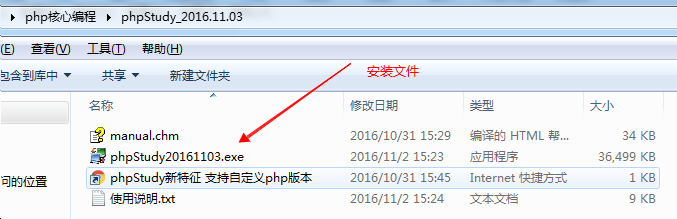
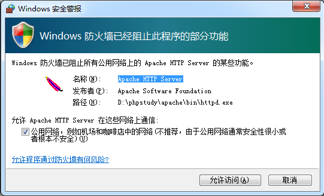
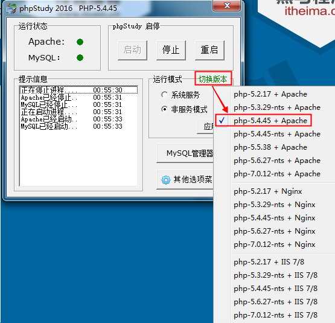
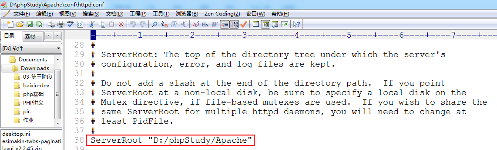
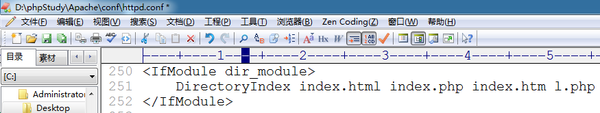
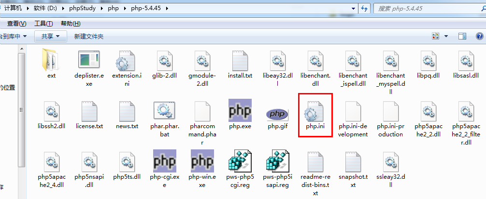
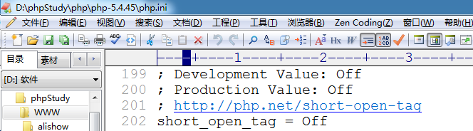
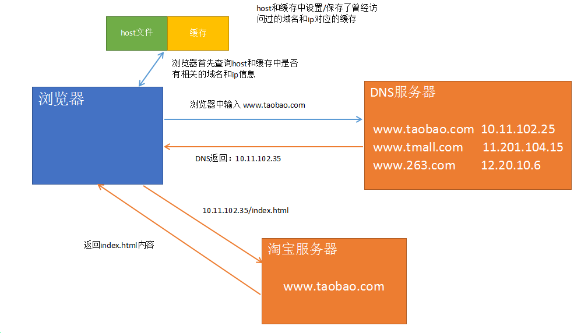
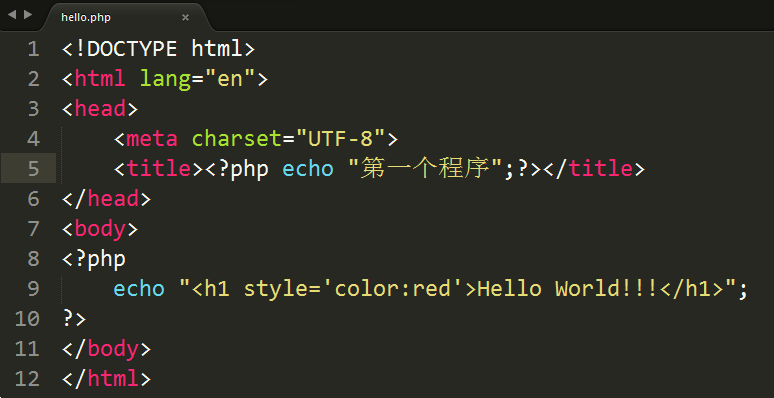
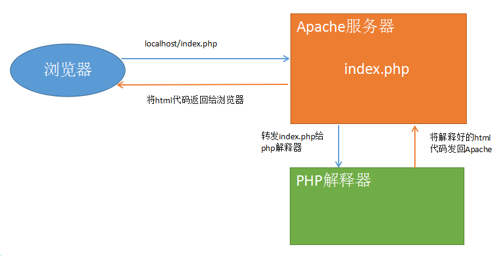

# **PHP核心编程-01** #
# 1. web服务器 #
   问题: 当我们写好一个html文件，放在桌面上时，别人能不能通过浏览器访问？
   答: 不行。 必须将我们的html文件放入==web服务器==，其他人通过网络才能访问。
##   1.1 什么是服务器？ ##
   服务器可以从硬件、软件(系统软件、应用软件)两个角度描述。

   按硬件描述： 服务器就是一台超级计算机。
   按系统划分： 在硬件上安装了什么操作系统，就可以称为该系统的服务器
	                   例如:  linux服务器、windows服务器、unix服务器等。
   按软件划分： 在操作系统中安装了什么软件，就可以称作该软件的服务器
	                   例如:  ==web服务器、数据库服务器==、邮件服务器等。


##   1.2 Web服务器 ##
  Web服务器就是安装了Web服务软件，能够提供网站服务的服务器。淘宝、京东、新浪等等

  常见的Web软件：
    ==Apache==、Nginx、IIS、Tomcat、Node等。
    Apache服务器、Nginx服务器、IIS服务器、Tomcat服务器、Node服务器

​    Apache是世界使用排名第一的Web服务器软件。我们将编写好的html、css、js等文件存入apache，就能够通过网络来访问这些文件了。

​    PS: web服务器又叫做http/httpd服务器

   数据库服务器就是安装了数据服务软件，能够提供数据增删改查操作的服务器。

   常见的数据库服务器：
      MySQL、 Sqlserver、 Oracle、 DB2等
      MySQL服务器、SqlServer服务器、Oracle服务器、DB2服务器等。


# 2. PHP概述 #
##    2.1 PHP简介 ##
​        PHP（外文名:PHP: Hypertext Preprocessor，中文名：“超文本预处理器”）是一种通用开源脚本语言。主要适用于==Web领域的开发==，能够完成动态网页的制作。

##    2.2 PHP特点 ##
- PHP是目前最流行的网站开发语言（B/S结构）之一。
- PHP是一种在服务器端执行的嵌入HTML文档的脚本语言。
- PHP 独特的语法混合了 C、Java、Perl 以及 PHP 自创新的语法。
- PHP是一种解释型弱类型语言  （编译型）
- 支持几乎所有流行的==数据库==以及操作系统。
- 源码开放、免费（free）   Zend

##    2.3 B/S结构和C/S结构 ##
  C/S软件体系结构，即Client/Server (客户机/服务器)结构。
     核心特点：==要下载一个客户端==，例如：QQ、微信、LOL、王者荣耀、绝地求生等。   

  C/S结构的软件，服务器主要做==数据转发==工作。以QQ聊天为例：
     任何两个人聊天的内容都会发送到QQ服务器上，然后再由QQ服务器进行转发

​     王小贱和小仙女聊天
        唐小贱发送一句话，这句话会先发送到QQ服务器，再由QQ服务器转发到小仙女的客户端。


   B/S软件体系结构，即Browser/Server （浏览器/服务器）结构。
       核心特点：==使用浏览器（Chrome、Firefox等）进行操作==，例如：淘宝、京东、新浪等。

   B/S结构软件，服务器承担了所有业务，浏览器只是用来显示最终内容的。

  


思考问题： B/S的优势和劣势， C/S的优势和劣势。

 B/S的优势: 部署方便，容易维护。用户使用方便（一个浏览器即可）。
 B/S的劣势: 客户端功能简单

 C/S的优势: 功能强大
 C/S的劣势: 必须下载客户端非常麻烦，升级维护麻烦
# 3. 安装环境 （Apache和MySQL） #
##   3.1 准备工作 ##
   解压phpstudy包


   解压后:



##   3.2 安装 ##

   双击安装文件即开始安装


​    特别注意: **==phpstudy的安装路径中不允许出现中文==**


​    此处选择“是”


   设置防火墙允许访问， Apache和MySQL都要允许



 

 开启Apache和MySQL服务： 绿色圆圈表示启动， 红色方块表示停止


  测试:  开启任意浏览器，输入下列地址

  127.0.0.1  、  127.0.0.1:80

  localhost  、  localhost:80


l.php

看到上图说明已经安装成功


##   3.3 phpstudy目录结构 ##


phpstudy集成了 Apache、IIS、nginx三种最常见的web服务器软件和多个版本的PHP，并且通过图形化控制面板（phpstudy.exe）可以自由切换


切换服务器和php版本：  默认使用的是  ==Apache + php-5.4.45==




##  3.4 Apache目录结构 ##


配置文件中带 # 的都是注释项，不带的是有效的配置项



  

主要配置项：


重点:

  Listen: 如果报80端口被占用可以修改为其他值，例如：8088


DocumentRoot: 配置html、css、js、php等文件保存的路径。


DirectoryIndex:  默认访问文件配置



localhost =>  localhost/index.html

localhost : 首先在www目录下找 index.html；如果没有index.html，找index.php；如果没有Index.php找index.htm；没有则找 l.php。  如果连 l.php都没有，则会将 www 目录下的所有文件和文件夹以列表形式显示出来


##   3.5 PHP目录结构



  php.ini: php配置文件。  进入到 php-5.4.45目录




带 ； 是注释，不带的是有效配置项


##  3.6 WWW目录

   我们今后编写的所有网页文件（html、css、js、php）和网页所需要的资源文件（图片、音频、视频） 都需要保存在该目录下。


# 4. URL解析 #
##    4.1 URL地址说明 ##
   URL: uniform resource locator  统一资源定位器

   全URL: http://localhost:80/index.html  <==>   localhost

-  http: 超文本传输协议
-  localhost: 域名。（一般域名：www.taobao.com，www.sina.com.cn） localhost是特殊域名，每一台电脑都有，并且指向当前使用的电脑
-  80: 端口号。 apache的默认端口号为80，所以可以省略不写
-  index.html: 访问的文件的路径 (localhost指向了 d:/phpstudy/WWW)，所以该url地址访问的是  d:/phpstudy/WWW/index.html文件
-  如果没有指定访问的文件，则默认会访问index.html文件；如果没有index.html文件，则会以列表形式显示当前目录下的所有文件夹和文件

   localhost:  D:\phpStudy\WWW

##    4.2 IP ##
   IP: Internet Protocol  互联网协议，是为计算机网络相互连接进行通信而设计的协议。

​    处于互联网上的任何一台计算机都有一个独立的ip地址。
    ip地址由4段3位长度的数字组成， 3位数字的取值范围 0-255。如： 102.15.201.10

   特殊ip:
    127.0.0.1 : 回环地址，每一台电脑都有该ip，指向当前使用的电脑
    192.168.**.* *: 该网段是专门用于做==局域网==的ip段。

##  4.3 域名

   域名（Domain Name）： 每个网站都有一个自己的域名。人们可以在浏览器中输入域名来访问对应的网站。

   淘宝: www.taobao.com

   百度: www.baidu.com

   特殊域名：
          localhost: 本地主机。在浏览器中输入localhost就会访问当前操作的这台电脑的web服务器。

##    4.4 DNS ##
   DNS: Domain Name System  域名系统。主要工作是将域名转换为IP地址，因为我们通过浏览器访问网站时，实际上是去找对应的IP地址。

   域名: 网站的名称，就相当于人名。
   IP: 网站在网络上的实际地址，就相当于人的住址。

   一般访问网站时都是输入域名的(例如： www.tmall.com  www.163.com)，但是在实际访问时域名会被DNS转换为IP地址。

   DNS工作机制图:



  访问淘宝网: www.taobao.com    10.11.102.25
  ip地址是一串数字，不容易记忆。所以使用域名来代替IP地址。因为域名表现力更强，更容易记忆。

  浏览器中输入:  localhost/a.html 时，该地址会被解释为 127.0.0.1/a.html

  DNS： 域名系统。 将域名转换为ip地址 

 windows下查看dns缓存:
    ipconfig  /displaydns
    ipconfig  /displaydns > c:/dnscache.txt   将dns缓存导入到c:/dnscache.txt文件


 windows下清除dns缓存
    ipconfig  /flushdns

##    4.5 端口 ##
​    端口是英文port的意译，可以认为是设备与外界通讯交流的出口。程序和程序之间要进行数据交换就需要一个端口号。

   已被占用的著名端口号：
    80:   Web端口号， Apache、Nginx、IIS
    21:   FTP端口号， FTP软件
    22:   SSH端口号
    25:   sendmail端口号
    ......

  因为Web服务的默认端口号是80，所以在地址栏可以不输入，但是如果将端口号改为其他的（如：8088），那就必须输入端口号，才能正常访问。
# 5. 初识PHP #
##   5.1 Hello World ##



 

   访问结果:  localhost/php1/code/hello.php


##   5.2 程序解析 ##
  1) ==php文件不能使用中文进行命名==

  2) PHP程序可以和HTML进行混编，可以写在HTML中的任何位置，head和body均可

  3) php语言的标记
     **<?php**  php代码  **?>**   标准标记
     <?  php代码  ?>           短标记（需要修改php.ini文件打开）

  4) 指令分隔符：
     PHP语句使用 ‘;’  结束     ==必须==

  5) echo相当于js的 document.write 能够在页面上输出内容，包括输出标签、css样式代码等

  6) php文件中可以编写html、css、js代码，但是html文件中不能编写php代码。也就是说==后缀是php的文件才能编写php代码==
# 6. PHP运行原理 #


  www.baidu.com  没有写文件路径时，默认找index.html
  www.baidu.com/index.html

  localhost   <===>  localhost/index.html
## 6.1 HTML运行原理 ##


1)在浏览器的URL地址栏中输入 www.baidu.com/index.html 地址，点回车。请求就发送给百度服务器。
2)百度服务器找到index.html文件，并将文件的内容返回给浏览器
3)浏览器接收到index.html中的内容，渲染到页面上。

同理: localhost/a.html ,  则会返回 本机web服务器根目录下 a.html文件的内容。浏览器拿到内容后进行渲染。

## 6.2 PHP运行原理 ##
 ==apache不认识php==
 ==浏览器也不认识php==

 

 1) 在浏览器地址栏中输入 localhost/index.php ,点回车之后。将请求发送给apache服务器。
 2) 服务器找到 index.php文件之后，转发给php解释器
 3) php解释器将index.php文件中的php代码全部转为html，再返回给apache
 4) apache将处理好的html返回给浏览器，浏览器渲染后就可以看到页面

以 hello.php文件为例:


所有在 PHP标记中（<?php  ?>） 的代码会被PHP解释器解释为html代码

<?php echo "第一个程序";?>  --->   第一个程序

<?php  echo "<h1 style='color:red'>Hello World!!!</h1>";   --->  <h1 style='color:red'>Hello World!!!</h1>

# 7. PHP的数据类型 #
 PHP数据类型一共有8种:

-  基本类型(标量):

​     整型:     整数， 例如: 10, 234, -20, -35 
     浮点型:  小数,  例如: 3.1415, 2.13, 35.123
     布尔值:  true/false
     字符串:  使用单引号/双引号包含的内容, 例如: ‘abc’, “王者荣耀”

-  复合类型:

​     数组
     对象

-  特殊类型:

​     资源 、 null (空)

# 8. 变量 #
变量命名规则：

-  由字母、数字、下划线组成，必须以字母或者下划线起头
-  变量的长度可以是任意的，但不能超过255个字符
-  最前面需要加 $
-  变量名最好有意义，能够做到见名知意
-  当变量名由多单词组成时，最好使用下划线分割或者使用驼峰命名法
-  PHP变量区分大小写


以下变量名哪些是正确的：

```
$a、  $var、  $_123、  $1b、  $_#abc、  $b1c2
```

$1b    
$_#abc


# 9. 常量 #
 保存不会发生改变的数据(如：3.1415， 路径等)时，最好使用常量。

 常量的使用方法：
   声明:  define(常量名,  常量值, 大小写区分标志);   

​	true（不区分）/false（区分/默认）;

   使用:  echo  常量名;


# 10. 运算符 #
##    10.1 运算符种类 ##
- 算术运算符

- 字符串运算符
- 赋值运算符
- 比较运算符
- 逻辑运算符
- 其他运算符


 算术运算符：


 赋值运算符：


```
$a = 10;
$b = 20;
$a += $b;
echo $b;
echo $a;
```

 比较运算符：


 逻辑运算符：


  异或:
     true   xor   true   =  false
     true   xor   false  =  true
     false  xor   true   =  true
     false  xor   false  =  false


  其他运算符：


   三元运算符:   判断表达式？值1：值2

​    

   php默认内置有4种错误： 
        notice： 通知错误
        Warning error： 警告错误
        Parse error： 解析错误
        Fatal error： 致命错误 


##   10.2 字符串运算符 ##
   字符串拼接:   .  

```
$a = 'abc';
$b = '10';
echo $a . $b;  // abc10;
$c = 10;
$d = 20;
echo $c . $d; 
```

   

##   10.3 =、==、 = ==的区别 ##
   =:    赋值运算符
   ==:  判断运算符，判断两个变量的值是否相等
   ===: 全等运算符，判断两个变量的值和数据类型是否相等

  

```
$a = 10;
$b = '10';

echo $a == $b ? 1 : 0;
echo $a === $b ? 1 : 0;
```


# 11. 流程控制 #
##   11.1 选择结构  (if...else) ##
```
if(判断表达式){
	程序块1;
} else {
	程序块2;
}

if(判断表达式){
	程序块;
} elseif(判断表达式){
	程序块;
} ...{
} else {
	程序块;
}
```

 

##   11.2 循环结构  (while / for / do...while) ##
```
while(判断表达式){
	程序块;
}

for(赋值表达式; 判断表达式; 步进表达式){
	程序块;
}

do{
	程序块
} while(判断表达式)

下面循环执行几次?
for(i = 1; i == 1; $i++){}
for(i = 1; i = 1; $i++){}
```

*
**

***

```
for($i = 1; $i <= 10; $i++){
    echo $i;
}


for($i = 0; $i < 10; $i++){
    for($j = 0; $j <= $i; $j++){
        echo '*';
    }
    echo "<br>";
}
```


##   11.3 分支结构  (switch) ##

```
switch(变量){
	case 值1:
		程序块1；
		break;
	case 值2:
		程序块2；
		break;
	...
	default:
		程序块
}
   
变量一般使用 : 整型  字符  字符串
```


##   11.4 特殊语句  (continue、 break) ##
​	contiune: 结束当前循环，直接跳入下一次循环
	break: 结束整个循环

# 12.数组 #
##  12.1 数组声明 ##
   PHP的数组分为索引数组和关联数组两类:
     索引数组: ==下标是数字==的数组就是索引数组
     关联数组: ==下标是字符串==的数组就是关联数组

   格式:
     $arr = array();
     $arr = [];

```
//声明索引数组
//如果不指定下标，默认是从0开始，依次自增1
$users1 = ['张三', '李四', '王五'];
$users2 = array(30, 40, 50);

//声明关联数组
$user_info = ['name'=>'黑猫警长', 'age'=>8, 'gender'=>'male'];
$user_info1 = array('name'=>'黑猫警长', 'age'=>8, 'gender'=>'male');
```


##  12.2 数组读写

   不管是索引还是关联数组，都是通过下标来进行读写控制的。

  

​     

##  12.3 数组遍历 ##
​    foreach 语句结构，用来遍历数组(关联数组和索引数组均可)。

​    格式: 

```
foreach($arr as $key=>$value){}

foreach($arr as $value){}    
```

​      $arr : 要遍历的数组      
      $key: 单元的下标
      $value: 单元的值

```
$user_info = ['name'=>'黑猫警长', 'age'=>8, 'gender'=>'male'];

foreach($user_info as $a=>$b){
    echo $a .'=>'. $b . "<br>";
}

foreach($user_info as $value){
    echo $value . ',';
}
//默认索引：   0      1      2
$arr = array('aaa', 'bbb', 'ccc');

foreach($arr as $k=>$v){
    echo $k . '==' . $v . '<br>';
}
```


##  12.4 二维数组和多维数组 ##
​     一维数组的单元中，保存了一个数组，那么该数组就是二维数组

   

​    二维数组可以想象成一个表格:

   

​      二维数组同样也用下标来进行控制:

```
echo $arr[0][2];  // c
echo $arr[1][1];  // bb
echo $arr[2][2];  // ccc
```

 

​      二维数组常用来存储一组相似/相关的数组

     

 

```
echo $list[0]['name'];   // 蝙蝠侠
echo $list[1]['age'];    // 33
echo $list[2]['gender']; // 女
```


##  12.5 遍历二维数组

​     核心: foreach取出的$value是一个一维数组

   方式1： 两层foreach嵌套

```
$list = [
    0=>['name' => '蝙蝠侠', 'age' => 30, 'gender' => '女'],
    1=>['name' => '蜘蛛侠', 'age' => 32, 'gender' => '女'],
    2=>['name' => '猪猪侠', 'age' => 30, 'gender' => '男']
];

echo "<table border=1 width=600>";
echo "<tr>";
echo "<th>姓名</th><th>年龄</th><th>性别</th>"
echo "</tr>";

//将$list中每一个数据循环输出
foreach($list as $value){
    //第一次循环: $value = ['name' => '蝙蝠侠', 'age' => 30, 'gender' => '女']
    echo "<tr>";
    foreach($value as $v){
        echo "<td>".$v."</td>";
    }
    echo "</tr>";
}

echo "</table>";
```

   方式2： 一层foreach，第二层单独输出

```
<body>
<?php 
$list = [
    0=>['name' => '蝙蝠侠', 'age' => 30, 'gender' => '女'],
    1=>['name' => '蜘蛛侠', 'age' => 32, 'gender' => '女'],
    2=>['name' => '猪猪侠', 'age' => 30, 'gender' => '男']
];
?>
<table border="1" width="600">
    <thead>
        <tr>
            <th>姓名</th><th>年龄</th><th>性别</th>
        </tr>
    </thead>
    <tbody>
        <?php foreach($list as $value) { ?>
        <tr>
            <td><?php echo $value['name']; ?></td>
            <td><?php echo $value['age']; ?></td>
            <td><?php echo $value['gender']; ?></td>
        </tr>
        <?php } ?>
    </tbody>
</table>

</body>
```


##  12.6 print_r函数 ##

   该函数能够输出数组中所有的数据，在项目开发时经常使用该函数查看数组中的所有数据

```
$arr = ['aaa', 'bbb', 'ccc'];
//echo 只能输出基本类型 --- 整型 浮点型 布尔型 字符串
//echo $arr;
print_r($arr);

$list = [
    0=>['name' => '蝙蝠侠', 'age' => 30, 'gender' => '女'],
    1=>['name' => '蜘蛛侠', 'age' => 32, 'gender' => '女'],
    2=>['name' => '猪猪侠', 'age' => 30, 'gender' => '男']
];

print_r($list);
```


##  12.7 图片列表页 ##


思路分析：

  在完成一个功能时，先规划实现该功能需要几个小步骤，再将每一个小步骤拆分成具体能实现的点。

  实现一个功能时，可以先找一个自己会的点进行切入，再根据需要进行延展。

  1) 使用html+css完成静态页面
  2) 图片、名字、尺寸等数据保存到一个数组中
  3) 在显示图片列表区域，将定义好的数组循环输出显示