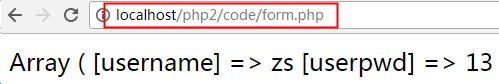

# **PHP核心编程-02**  

每日目标:

- 能够使用php声明和调用函数
- 能够说出php变量的作用域
- 能够使用一些常用的数学函数、日期函数、变量函数
- 能够说出什么是php超全局变量
- 能够使用get、post两种方式提交表单数据
- 能够说出get和post的区别

# 1. 函数

##    1.1 什么是函数？

   函数（function）是一段完成指定任务的已命名代码块

   PHP函数包括内置函数（系统函数）和自定义函数两类

##    1.2 函数的格式

   PHP声明函数的方式和Javascript一致。

```
function  函数名称（[参数1 [,参数2 [,…]]]）
{
	函数体;
	//如需函数有返回值时使用
	[return 返回值;]
} 
```

```
<?php 
header('content-type:text/html;charset=utf-8');

function cal($var1, $var2, $op){
    $result = null;
    switch ($op) {
        case '+':
            $result = $var1 + $var2;
            break;
        case '-':
            $result = $var1 - $var2;
            break;
        case '*':
            $result = $var1 * $var2;
            break;
        case '/':
            if($var2 == 0){
                echo "除数不能为0";
                return false;
            }
            $result = $var1 / $var2;
            break;
        default:
            # code...
            break;
    }
    return $result;
}

echo cal(100, 0, '/');
?>
```


##  1.3 变量的作用域

  核心概念: 在函数体外定义的变量，在函数体内无效
 	  	   在函数体内定义的变量，在函数体外无效

```
$name = 'zs';

function getName(){
    echo "我的名字叫" . $name;
}

getName();
```

  

```
function setName(){
    $name = 'ls';
}

setName();
echo $name;
```

全局变量 和 局部变量:
	局部变量:  函数体内的变量，该变量只在函数范围内有效。
	全局变量:  函数体外的变量，在整个php文件中都有效（除了函数）。


##  1.4 文件包含

  文件包含一共有4个函数:   include、include_once、require、require_once
  ==文件A中包含文件B，那么文件B就相当于文件A的一部分。==

  注意事项: 
    如果文件A和文件B定义了相同的变量，则会发生覆盖。
    如果文件A和文件B定义了相同的函数，则会发生致命错误。

  小扩展：
     实际项目开发中主要使用  include_once 和 require_once两个函数，因为这两个都只加载一次目标文件
     require/require_once 一般使用在文件的开头或者结尾，用来包含另一个页面
     include/include_once 一般使用在流程控制语句中
     include/include_once 在引入一个文件时，如果该文件不存在，会报错，但是程序依然执行下去；而require/require_once引入的文件不存在时，则会产生一个 Fatal error

 

##  1.5 静态变量 --- static

​    声明变量时，在前面增加 static关键词，则该变量就设置为静态变量。
    如果在函数体内定义的变量使用了static关键词，那么不论该函数被调用了多少次，该变量只有一个。


## 1.6 全局变量 --- global

​    如果在函数体内强制使用函数体外定义的变量，则可以使用global

```
$name = '张三丰';

function sayHi(){
    //使用global来声明，调用函数体外定义变量
    global $name;
    echo "欢迎您回来，尊敬的会员" . $name;
}

sayHi();
```


# 2.常用系统函数

##  2.1 数学函数

```
int round( $float ): 四舍五入
int ceil( $float ):  向上取整(进一法)
int floor( $float ):  向下取整(取整法)
int rand( min $int, max $int):  获取随机数
```


##  2.2 日期函数

```
int time():  获取当前时间点的时间戳
string date(format $str, timestamp $int): 可以将时间戳转为年月日时分秒的形式
int strtotime(format $str):  将一个日期格式的字符串转为时间戳
```


```
date函数说明：

参数1: 要显示的时间格式
参数2: 时间戳, 可选参数, 如果不指定则为当前时间戳
返回值: 指定的时间格式

时间格式参数:
Y: 4位年
m: 带前导0的2位月   01  02
d: 带前导0的2位日
H: 带前导0的2位时
i: 带前导0的2位分
s: 带前导0的2位秒

修改时区有两种方法:
1)  使用函数 ---- date_default_timezone_set();      临时修改
2)  修改php配置文件 php.ini                         永久修改
北京时间: PRC (中国人民共和国)  或者  aisa/shanghai (亚洲/上海)
```


主要: 修改完apache或者php的配置文件之后，一定需要重启apache服务器

##  2.3 变量函数 

```
bool empty($var): 判断变量是否为空
bool isset($var): 判断一个变量是否被设置
void unset($var): 删除一个变量
void var_dump($var) : 输出变量信息（数据类型  值）
void print_r($var)

void: 无返回值
```

​    注意事项:  php中使用echo输出布尔值时，true会被输出为1，false什么都没有；可以使用==强制转换==，将false输出为 0。

​    debug的核心思想： 跟踪变量。 确定在程序中的任何一个变量中的值是正确的。

   

举例: 获取span的内容  <span id="s">aaaaa</span>

var dom_span = document.getElementById('s');

dom_span.innerHTML

var jq_span = $('#s');

jq_span.html();


##  2.4 数组常用函数

```
bool in_array(mixed, arr);  检查一个值是否存在于一个数组当中
array explode(delimiter, str) 使用一个字符串将另一个字符串分割为数组
string implode(str, arr) 使用一个字符串将一个数组链接为字符串
```


# 3. 超全局变量(预定义数组)

##   3.1 什么是超全局变量

​    PHP内置的变量，在每一个php文件中都可以直接使用。

​    特点: 
	在每个页面都能直接使用
	内部都是==关联数组==结构

```
非常重要: $_GET、$_POST、$_SESSION、$_COOKIE、$_FILES
知道: $_SERVER、$_REQUEST、$GLOBALS
```

 

##   3.2 $_SERVER	


重要数据:   REQUEST_URL 、SCRIPT_NAME 、PHP_SELF， 这三个都是指向当前访问的php文件


 

##   3.3 表单处理（提交/接收）

  表单处理就是将表单的数据提交到一个后端php页面进行处理，例如：新用户注册。
  所以需要两个页面:

​      1)  form.html，表单页，用户可以在表单页上填写相关数据
      2)  form.php ,  数据接收处理页， 接收用户在表单填写的数据，然后做进一步处理


  表单提交关键点总结:

  表单页: form.html
   1) 必须有form表单标签，form必须有action 和 method 两个属性
	action: 指定表单数据提交的位置
	method: 表单提交的方式， post 、get(默认)
   2) 每个表单域都要有name属性
   3) 必须有submit类型的按钮

 数据接收处理页： form.php
    1) method=post时，使用$_POST接收数据    
    2) method=get时，使用$_GET接收数据
    3) 不管是`$_POST`还是`$_GET`，都是一个关联数组，数据的下标就是表单域中 name 属性的值


##   3.4 每种域和类型的提交方式

  表单标签： form 、 ==input 、 select 、 textarea==

  ==表单提交的实际上是每个域的value值==

  1) input  type= text/password/hidden  提交的就是value属性中的值

  2) input  type=radio  提交的是选中项（checked）的value值

  3) input  type=checkbox  在name的值后增加[] 转换成数组结构，后端才能接收到所有的选项

  4) select  name值需要定义在select标签中； value定义在option中，每条option都有自己的value

  5) textarea  name值定义在textarea标签中，value没有显式的表示出来，就是开始标签和结束标签之间的内容

 


##   3.5 post和get的区别 (非常重要)

==通过URL地址栏来区分post和get==

get将提交数据拼接成字符串显示在URL地址栏中


post不显示



 

1) 提交方式
   get会将数据显式的拼接到url地址栏中  (字符串)
	例如： index.php?id=1==&==name=zs==&==age=20==&==key=value....
	key=value方式传参，多个参数之间使用&符号隔开

   post不会显示出来，post的安全性比get高一点点。

2) 传递数据量大小
   post默认的最小值是2M，可以通过修改php配置文件来修改大小，理论上没有上限的。
   get会受到浏览器的地址栏的限制。有的是2k，有的是8K(chrome)

 修改php.ini来修改post表单提交的最大值


 

3) 应用范围不一样
   post在绝大多数情况下都使用在表单提交中。
   get的应用范围比较广。在a标签的href中，location.href中等都能使用get方式。

   在所有页面跳转的地方，都可以使用get方式拼接字符串来达到传递数据的目的。

 

# 4. 文件上传

  文件上传属于一种特殊的表单提交，所以也需要两个页面 ---  表单页  和   数据处理页。


 


文件上传关键点总结:

 1) upload.html （文件上传表单页）

   ① 必须有form标签
	action: 指定后台处理程序的路径
	method: 指定提交方式 ---  文件上传时必须使用==post==
	==enctype=”multipart/form-data”  --- 文件上传时必须指定该属性==

   ② 文件域也必须有name属性和值
   ③ 也必须使用submit类型的按钮来提交表单 


 2) upload.php （文件上传处理页）

​    ==① 选择好文件，点击submit提交表单时，文件就已经上传到服务器，存放到一个指定的临时路径下。可以在upload.php页面中使用 $_FILES 来查看上传后的文件信息==

​    $_FILES是一个二维数组，第一维下标是文件域的name值，第二维有5个下标
     i. name: 上传文件的名称
     ii. type: 上传文件的类型
     iii.  tmp_name: 上传文件临时保存的路径
     iv.  error: 错误码，0代表没有错误
     v.  size: 上传文件的大小，单位是 bit 


​    ② move_uploaded_file() 函数将文件从临时路径，移动到想要保存到的位置
      move_uploaded_file(var1, var2);
      参数1: 临时保存的路径 ---   `$_FILES['pic']['tmp_name']`     (pic是文件域的name值，当然也可以是别的)
      参数2: 目标路径， 需要带上文件名


# 5. 字符串

## 5.1 字符串的三种声明方式

   1) 双引号:   $str = “abcdefg”;
   2) 单引号:   $str = ‘abcdefg’;
   3) 定界符: 用来定义带有格式的超大字符串
          $str =<<<DOC
    	字符串内容
      DOC;

​    使用定界符注意事项:
	① 使用 <<< 作为定界符的起始符号
	    ② doc是定义字符串标志，该标志可以使用任何单词/字母
	③ doc必须结束，并且结束点必须在一行的开头

## 5.2 获取\设置字符串中的单个字符

​    字符串也是有下标的， 下标同样从0开始。

​    

## 5.3 单引号和双引号的区别

 区别:
    在双引号中间的变量会被解释为值
    在单引号中间的变量会被解释为字符串

 

 使用技巧:  ==字符串拼接==

 

## 5.4 字符串常用函数

```
string substr (string $string , int $start [, int $length]);
void die/exit ([string $msg])
string md5(string $str);
strpos(string $str, string $char);
strrpos(string $str, string $char);
```

