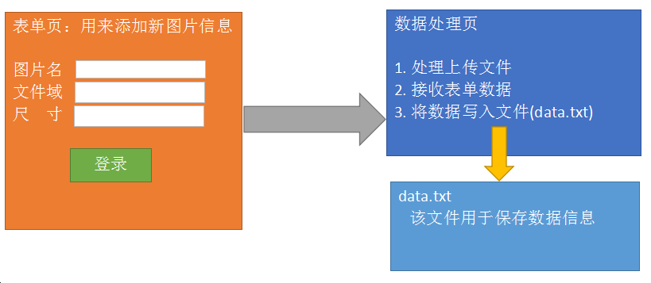

# PHP核心编程-03

每日目标

- 能够处理文件上传
- 掌握字符串的声明方式和单双引号之间的区别
- 熟悉常用的字符串函数
- 掌握文件读写函数的使用
- 能够完成添加新壁纸
- 能够完成壁纸列表

# 1. 字符串

##  1.1 字符串的三种声明方式

   1) 双引号:   $str = “abcdefg”;
   2) 单引号:   $str = ‘abcdefg’;
   3) 定界符: 用来定义带有格式的超大字符串
          $str =<<<DOC
    	字符串内容
      DOC;

​    使用定界符注意事项:
	① 使用 <<< 作为定界符的起始符号
	    ② doc是定义字符串标志，该标志可以使用任何单词/字母
	③ doc必须结束，并且结束点必须在一行的开头

##  1.2 获取\设置字符串中的单个字符

​    字符串也是有下标的， 下标同样从0开始。


##  1.3 单引号和双引号的区别

 区别:
    在双引号中间的变量会被解释为值
    在单引号中间的变量会被解释为字符串

 

 ==字符串拼接技巧==   --->  大括号包治百病

 

 

##  1.4 字符串常用函数

```
string substr (string $string , int $start [, int $length]);
void die/exit ([string $msg])
string md5(string $str);
strpos(string $str, string $char);
strrpos(string $str, string $char);
```

 

# 2. 综合案例：完善文件上传功能

 1) 只允许上传图片类文件  ---  png  jpg  gif
 2) 上传文件名称要改为随机字符串  ---  防止后上传文件覆盖先上传文件

 

 upload.html文件  --->  保证文件能够正常上传

  1) form： action  method="post"  enctype="multipart/form-data"
  2) 文件域要有name
  3) 有submit按钮


  upload.php

   1) 判断文件上传是否有错(`$_FILES['pic']['error'] ==0`)
	如果不等于0，则报错并跳转回upload.html
	    等于0继续向下执行
   2) 判断文件类型  `$_FILES['pic']['type']`

​     `in_array($_FILES['pic']['type'], ['image/jpeg', 'image/png', 'image/gif'])`

​     如果返回为false，则报错，跳转回upload.html
     如果返回为true，继续向下执行

   3) 修改文件名

​      截取文件后缀 --->   获取最后一个. 的下标，再根据下标从 `$_FILES['pic']['name']` 截取后缀
      拼接新文件名 --->   time().rand(10000, 99999).$ext

   4) 将文件从临时位置移动到想要保存的位置
       返回true，提示文件上传成功
       返回false, 提示文件上传失败，跳转回upload.html

# 3. 文件读写

## 3.1 读取文件内容

```
string  file_get_contents(string $file);
参数: 文件路径，可以是本地文件的路径，也可以是网络地址
返回值: 文件内容

//获取本地文件的内容
echo file_get_contents('./a.txt');

//获取网络文件的内容
echo file_get_contents('http://www.baidu.com/index.html');
```

   

## 3.2 向文件中写入内容

```
int file_put_contents(string $file, string $data[, constants flag]);
参数1: 文件路径
参数2: 要写入文件的字符串
参数3: 可选参数，默认不写，新内容覆盖原文件中的内容；FILE_APPEND是向文件中追加内容
返回值: 写入文件的字符串长度

echo file_put_contents('./a.txt', 'ccc', FILE_APPEND);
```


## 3.3  序列化 和 反序列化

   file_put_contents函数不能将数组直接写入文件，因为数组不能直接转化为字符串。

   如果想将数组转为字符串，使用 serialize函数；如果想将==序列化字符串==转为数组，使用unserialize函数

   string  ==serialize==($arr):  将数组转为字符串，该字符串是一种特殊结构的字符串。
   array  unserialize(string): 将序列化的字符串转为数组

   

```
$arr = [
    0=>['id'=>1, 'name'=>'zs', 'age'=>20],
    1=>['id'=>2, 'name'=>'ls', 'age'=>20],
    2=>['id'=>3, 'name'=>'ww', 'age'=>20]
];
//将数组序列化成字符串
$str = serialize($arr);
echo $str;

结果:
a:3:{i:0;a:3:{s:2:"id";i:1;s:4:"name";s:2:"zs";s:3:"age";i:20;}i:1;a:3:{s:2:"id";i:2;s:4:"name";s:2:"ls";s:3:"age";i:20;}i:2;a:3:{s:2:"id";i:3;s:4:"name";s:2:"ww";s:3:"age";i:20;}}

结构化:
a:3:{
 i:0;a:3:
	{
	   s:2:"id";i:1;
	   s:4:"name";s:2:"zs";
	   s:3:"age";i:20;
 	}
 i:1;a:3:
	{
	   s:2:"id";i:2;
	   s:4:"name";s:2:"ls";
	   s:3:"age";i:20;
	}
 i:2;a:3:
	{
	   s:2:"id";i:3;
	   s:4:"name";s:2:"ww";
	   s:3:"age";i:20;
	}
}
```


```
//1. 从b.txt中读取结构化好的字符串
$str = file_get_contents('./b.txt');
echo $str;
echo "<hr>";
//2. 将字符串发序列化成数组
$arr = unserialize($str);
echo $arr[1]['name'];
echo "<hr>";
print_r($arr);
```


# 4. 综合案例--添加新壁纸

## 4.1 添加新壁纸



 思路分析:  三个文件完成该功能    表单页 、 数据处理页 、 数据保存文件

​    1) 表单页（upload.html）

​         保证数据能够正常提交，文件能够正常上传

​    2) 数据处理页 (upload.php)

​	① 文件上传
	② 接收表单数据
	③ 将数据写入data.txt文件

​    3) 数据保存页 (data.txt)

​        在该文件中保存的数据必须是被json_encode处理过的数组

 

 

  关键点总结：

  1) 表单页（upload.html）

​     表单要上传文件，所以必须有  enctype属性

  2) 数据处理页（upload.php）

​     ① 因为上传的是图片，所以要做检测上传文件后缀，还要重命名文件防止覆盖
     ② 创建数组用来保存表单接收的数据，数组应该有三个单元 (name  size  url)
     ③ 要先将data.txt文件中的数据读出来
     ④ 将表单提交的数据


## 4.2 壁纸列表

思路分析:
  1) 从文件中读取数据并恢复成数组结构
  2) 循环将数据进行输出


## 4.3 壁纸删除


