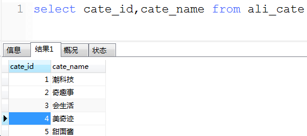
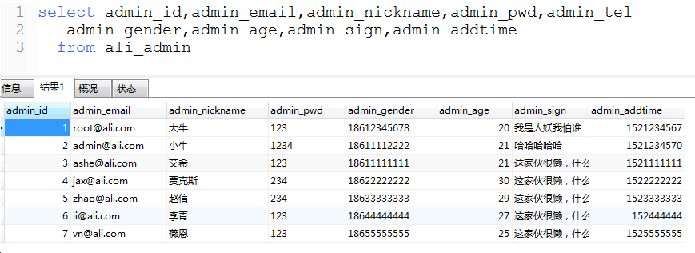
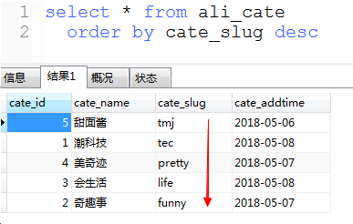
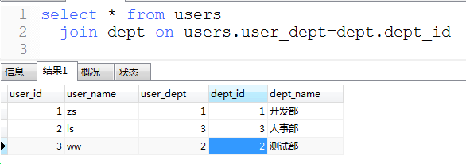
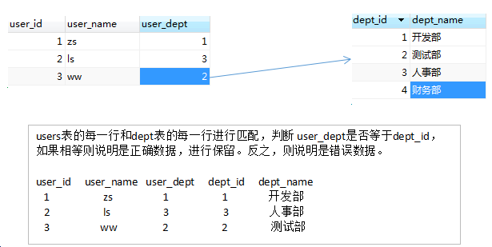
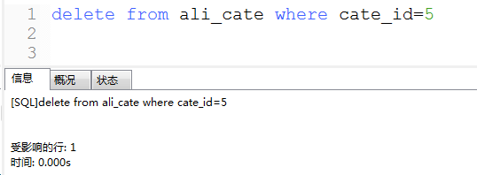

# **PHP核心编程-05**

每日目标

- 能够使用SQL语句进行基本查询
- 能够使用SQL语句删除数据
- 能够使用SQL语句修改数据
- 能够开启php的mysql扩展
- 能够使用php的mysql扩展库操作MySQL数据库

# 1. ****数据查询****

格式: 

​==SELECT==  字段名1, 字段名2, ......  ==FROM==  表名	      [ WHERE <条件表达式> ]      [ ORDER BY <字段名> [ ASC|DESC ]]

​      [ LIMIT  START, LENGTH]

 

##  **1.1 基本查询**

格式:  select  字段名1, 字段名2,....  from  表名

 案例1: 查询已有的所有栏目的id和名称

   表: ali_cate    字段:  cate_id、cate_name

   


 案例2: 查询管理员信息 (全部字段信息)

  表: ali_admin

  方式一: 在select 和 from 之间列出所有的字段

 

  方式二:  使用 * 来代替所有字段

 


 在实际开发中要用方式一。


完成基本查询:  要知道去哪个表查询，也要知道查询哪几个字段


##  **1.2 带where子句的查询**

select  field1, field2... from 表名  查询表中的所有数据

  where 可以使用条件来筛选查询出的结果

 

案例3: 查询id值为2的栏目的所有信息

 表: ali_cate    查询字段: *    筛选条件   cate_id=2

 


案例4: 查询年龄大于25的管理员的邮箱和昵称

 表: ali_admin    查询: admin_email、admin_nickname   筛选条件  admin_age>25


案例5: 查询年龄在23-28之间的管理员的所有信息

 包含 23 和 28

 表: ali_admin   字段: *    筛选条件  admin_age>=23  admin_age<=28

 


 筛选条件使用 between ... and ...


案例6: 查询年龄不在23-28之间的管理员的所有信息

 


案例7: 查询年龄大于25的男性管理员信息

表:ali_admin   字段：*    筛选条件： admin_age>25   admin_gender='男'


 

##  **1.3 in关键词**

集合:  一组相同类型的数据，使用()来包含，括号内使用 ， 分隔开

(1, 2, 3, 4, 5)    (‘潮科技’, ‘会生活’, ‘奇趣事’, ‘美奇迹’)

案例8: 查询年龄为20、28的女性管理员信息


将 20和28作为一个集合


##  **1.4 模糊查询**

通配符:
  %: 代表任意长度(包括0)的任意字符
  _: 代表1位长度的任意字符

  a%b :  ab  abb  a对萨达b
  a_b :   acb  atb   a啊b  
  a_b% :  acb   a&baaad

 like: 在执行模糊查询时，必须使用like来作为匹配条件

案例9: 查询邮箱地址中包含字符h的管理员信息

 表: ali_admin   字段: *    筛选条件：  admin_email  like  ‘%h%’

 


案例10: 查询包含“科技”关键词的文章信息

表: ali_article   字段: *   筛选条件:  article_title like '%科技%' ， article_text like ‘%科技%’


案例11: 查询邮箱以a字符开头并且包含n的管理员信息

表: ali_admin   字段：*   筛选条件： admin_email like 'a%n%'


##  **1.5 order by 排序**

order by 可以对查询结果按某个字段的升降进行排序

  升序 asc （默认值） ，  降序 desc 

可进行排序的字段通常是  整型  英文字符串型  日期型  (中文字符串也行,但一般不用)

案例12: 查询所有的栏目信息，并按别名的降序排列

表: ali_cate  字段：*      order by cate_slug desc




案例13: 查询所有栏目信息，并按发布时间升序排列

表: ali_cate  字段：*      order by cate_addtime  asc


案例14: 查询所有男性的管理员信息，并按照创建时间降序排列

表: ali_admin    字段:*    筛选条件:  admin_gender='男'     排序: order by  admin_addtime  desc


 

##  **1.6 limit 限制**

limit用来限制查询结果的起始点和长度

 格式:  limit var1, var2

 var1: 起始点。 查询结果的索引，从0开始。 0代表第一条数据

 var2: 长度


案例15: 查询年龄最大的3名男性管理员的信息

表: ali_admin   字段：*     筛选: admin_gender=‘男’    排序：按照年龄降序排列  order by admin_age desc

限制前3条    limit 0, 3


案例16: 将文章按发布时间逆序排列，并取出第三条到第五条

表: ali_article   字段: *    排序: order by  admin_addtime desc   限制：limit 2, 3


##  **1.7 多表查询**

关键词: join

语法格式:  

​	select * from 表1
	  join 表2  on  链接条件   （表1.字段=表2.字段）
	      join 表3  on  链接条件   （）
	      .....


用户表: 

​    user_id
    user_name
    ==user_dept==

部门表:

​    ==dept_id==
    dept_name

目标: 查询所有员工信息，并显示该员工的部门名称




运行原理的理解:




案例17: 查询所有文章信息，作者使用昵称显示

表:  ali_article 、ali_admin     字段: ali_article.* , ali_admin.admin_nickname
链接条件：  ali_article.article_adminid=ali_admin . admin_id


案例18: 查询大牛发布的所有文章信息，作者使用昵称显示

表:  ali_article、ali_admin      链接条件   article.article_adminid=admin.admin_id

筛选条件： where  admin_nickname='大牛'


案例19: 查询属于潮科技和奇趣事的所有文章

表:  ali_article、ali_cate        链接条件 : article.article_cateid=cate.cate_id

筛选条件:  where cate_name  in  (‘奇趣事’,'潮科技')

 


案例20: 查询所有文章信息，作者使用昵称显示，栏目使用栏目名显示

表:  ali_article、ali_admin、ali_cate

链接条件： 要使用两次join   article.article_adminid=admin.admin_id    article.article_cateid=cate.cate_id

 

# 2. **修改数据**

格式:  

  update 表名  set  字段1=值1, 字段2=值2,...  where 修改条件

  修改表中的哪一条（几条）数据的 字段1=值1...


案例21: 将id为6的管理员昵称改为瞎子


案例22: 将所有男性管理员的年龄都+1


 

# 3. **删除数据**

格式:  delete from 表名  where 删除条件

案例25: 删除cate_id=5的栏目




# 4. **开启Mysqli扩展**

PHP操作MySQL数据库，可以使用 mysql、mysqli、pdo三种方式。

MySQLi是php操作MySQL数据库的一组函数，默认没有开启，必须手动开启。（但是，phpstudy是开启的。默认情况下，php里面的很多库是没有开启的，必须手动开启，例如: 绘图库）

1) 打开php配置文件 （php.ini），查找 extension_dir，去掉前面的 ；注释，并将路径改为绝对路径

 


2) 打开mysqli扩展，在php配置文件中，搜索 mysql.dll，去掉  ；extension=**php_mysqli.dll** 前面的 ；

   php_mysqli.dll 就是mysqli函数库

 


3) 确定D:\phpStudy\php\php-5.4.45\ext 目录中有 php_mysqli.dll文件

 


以上三步就是告诉系统，去加载  D:\phpStudy\php\php-5.4.45\ext  目录下的 php_mysqli.dll文件。该文件中包含了php操作mysql数据的函数


4) 重启apache服务器

5) 测试

 创建  info.php文件，编写如下代码


访问


能够看到上图，就说明mysqli能够正常访问


# 5. **PHP操作MySQL**

1) 链接MySQL服务器  
2) 选择要操作的数据库
3) 设置字符集 （不设置字符集可能会出现乱码问题）
4) 执行SQL语句
5) 处理SQL执行结果
6) 关闭MySQL链接

 

1) 链接MySQL服务器 --- mysqli_connect(var1, var2, var3)

  参数1: MySQL数据库的主机地址
  参数2: 用户名
  参数3: 用户名对应的密码
  返回值: 数据库链接资源

  `$conn = mysqli_connect('localhost', 'root', 'root');`

 

2) 选择要操作的数据库  --- mysqli_select_db(var1, var2)

  参数1: 数据库链接资源
  参数2: 数据库名称

 `mysqli_select_db($conn, 'demo');`

 

3) 设置字符集 --- mysqli_query(var1, var2)

  参数1: 数据库链接资源
  参数2: sql 语句 ----  set names utf8

  `mysqli_query($conn, 'set names utf8'); `


4) 执行SQL语句 --- mysqli_query(var1, var2)

  参数1: 数据库链接资源
  参数2: sql 语句 （一般是增删改查的SQL语句）
  返回值: 如果是查询，则返回结果对象，该对象里面包含了从数据表中取出的数据
               如果是增删改，则返回布尔值，执行成功返回true，失败返回false

  `$result = mysqli_query($conn, $sql); `


5) 处理**==查询结果==**

  **==mysqli_fetch_assoc(var);==**

  参数: 查询结果对象
  返回值: 一维数组，下标是数据表字段

  将当前行的数据取出并返回成一维数组，同时将指针向下移动一行。
  如果已经无法返回一维数组时，则返回false 

 

6) 关闭MySQL链接资源 --- mysqli_close(var)

   参数: 数据库链接资源


案例1: 向ali_cate表中添加一条数据

```
<?php 
//1. 链接MySQL服务器
$conn = mysqli_connect('localhost', 'root', 'root');

//2. 选择数据库
mysqli_select_db($conn, 'study');

//3. 设置字符集
mysqli_query($conn, 'set names utf8');

//4. 执行SQL语句
// 编写SQL语句
$sql = "insert into ali_cate values(null, '海底捞', 'hdl', '2018-05-09')";
// 执行SQL语句
// 返回值已定义布尔值
$result = mysqli_query($conn, $sql);

//5. 处理SQL执行的结果
if($result){
    echo "添加新栏目成功";
} else {
    echo "添加新栏目失败";
}

//6. 关闭MySQL链接
mysqli_close($conn);
?>
```


案例2: 查询ali_cate表中所有数据，显示在网页上


```
<?php
header('Content-type:text/html;charset=utf-8'); 
//1. 链接MySQL服务器
$conn = mysqli_connect('localhost', 'root', 'root');

//2. 选择数据库
mysqli_select_db($conn, 'study');

//3. 设置字符集
mysqli_query($conn, 'set names utf8');

//4. 执行SQL语句
$sql = "select * from ali_cate";
// 执行查询SQL语句时，返回值是对象。该对象中包含了查询的结果
$result = mysqli_query($conn, $sql);
var_dump($result);

//5. 处理SQL执行结果 --- 读取数据
//如果$row是一维关联数组，系统会默认它为true
//如果$row是null，系统会默认它为false
while($row = mysqli_fetch_assoc($result)){
    //$row = ['cate_id'=>2, 'cate_name'=>'奇趣事', 'cate_slug'=>'funny', 'cate_addtime'=>...];
    print_r($row);
    echo "<hr />";
}

//6. 关闭MySQL链接
mysqli_close($conn);
?>
```


# 6. 综合案例 ----  学生信息管理

  **==目标: 通过PHP网页来管理数据库，对数据表的数据进行增删改查==**

  数据表设计:  student

​    sno： 学号  整型  无符号  主键  自增长
    sname： 姓名  字符串
    sage： 年龄 无符号 微整型
    sgender： 性别 枚举
    semail： 邮箱
    stel： 电话

​    create table student(
	sno int UNSIGNED auto_increment PRIMARY key,
	sname VARCHAR(30) not null,
	sage tinyint UNSIGNED not null,
	sgender enum('男', '女') DEFAULT '男',
	semail varchar(30),
	stel   char(11)
	) engine=myisam DEFAULT charset=utf8;

 

 

##  6.1 添加新学生

  目标: 使用网页向student表中添加一条数据


表单（add.html）：

```
<!DOCTYPE html>
<html lang="en">
<head>
    <meta charset="UTF-8">
    <title>Document</title>
</head>
<body>
<form action="add_deal.php" method="post">
姓名: <input type="text" name="name"><br>
年龄: <input type="text" name="age"><br>
性别: <input type="text" name="gender"><br>
邮箱: <input type="text" name="email"><br>
电话: <input type="text" name="tel"><br>
<input type="submit" value="提交">
</form>
</body>
</html>
```


数据处理页(add_deal.php):

 

```
<?php 
header('content-type:text/html;charset=utf-8');
//1. 接收表单数据
$name = $_POST['name'];
$age  = $_POST['age'];
$gender = $_POST['gender'];
$email = $_POST['email'];
$tel  = $_POST['tel'];

//2. 将数据写入student表
//① 链接MySQL服务器
$conn = mysqli_connect('localhost', 'root', 'root');
//② 选择数据库
mysqli_select_db($conn, 'study');
//③ 设置字符集
mysqli_query($conn, 'set names utf8');
//④ 执行SQL语句
$sql = "insert into student values(null, '$name', $age, '$gender', '$email', '$tel')";
$result = mysqli_query($conn, $sql);
//⑤ 判断$result的结果
if($result){
    echo "添加新学生信息成功";
} else {
    echo "添加新学生信息失败";
}
//⑥ 关闭MySQL链接
mysqli_close($conn);

header('refresh:2;url=add.html');
?>
```


**==如果你的程序中出现错误，请第一时间查看SQL语句是否正确==**


从网页上复制SQL语句，放入navicat中执行