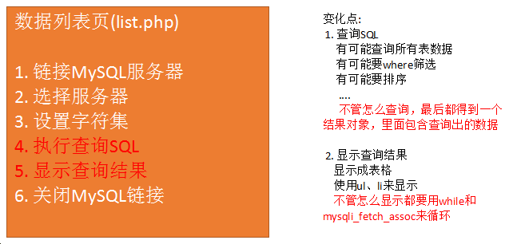
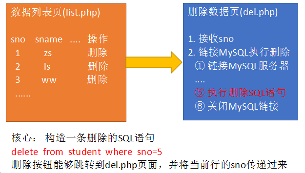
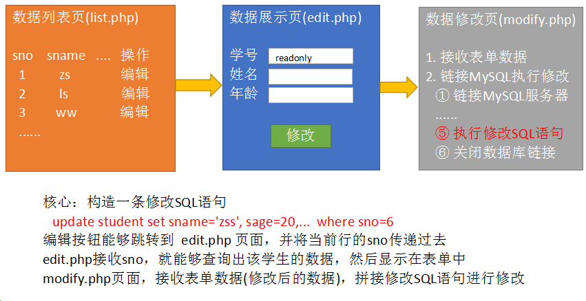
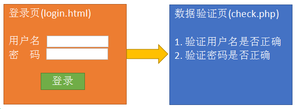
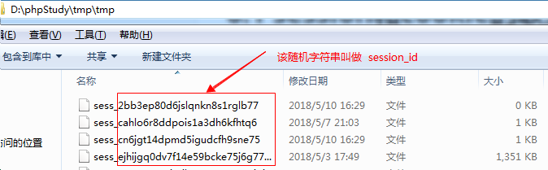
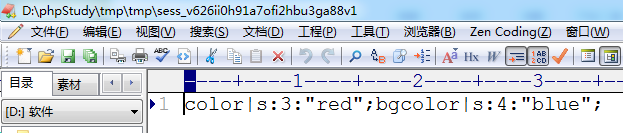

# **PHP核心编程-06**

每日目标

- 能够完成学生信息列表页
- 能够删除学生信息
- 能够修改学生信息
- 说出什么是cookie
- 说出什么是session
- 能够完成学生管理系统的登录操作

# 1. **学生信息管理系统**

##  1.1 学生信息列表

 

  目标:  将student表中的数据全部取出，并以表格形式显示在网页上。

  


##   **1.2 删除学生**

 核心SQL:  ==delete from student where sno=**5**==

 



步骤: 
   1) 在学生信息列表页(list.php)，为每一行都添加一个删除按钮，删除按钮可以跳转到另一个php(del.php)页面，在跳转时，将当前行的sno一起传递到del.php页面。

   2) del.php页面，接收sno，拼接删除的sql语句，再执行该SQL。再根据删除结果提示删除成功/删除失败。跳转回学生列表页。


 

##  **1.3 修改学生信息**

核心：构造一条修改数据的SQL语句   

   ==update student set sname='', sage=''..  where sno=6==




步骤:

 1) 在学生列表页(list.php)为每一行都添加一个“编辑”按钮，跳转到编辑表单页(edit.php)，并且要将当前行的sno一起传递到edit.php页面。

 2) 创建edit.php页面(和add.html页面结构一样)，接收sno，拼接SQL语句并执行，得到一个一维数组，将该数组的值填充到表单中。

 3) 创建一个修改页面(modify.php)，接收edit.php页面表单中的值，拼接一个修改的SQL语句，执行该SQL语句。根据修改结果提示修改成功/修改失败，再跳转


## 1.4 登录



###  

 验证逻辑:

 1) 根据用户名从ali_admin表中查询数据。如果有结果，则说明用户名正确；反之，说明用户名错误。 

​     编写SQL，根据用户查询数据。 如果用户名是存在于数据表，那么一定能查询到一条数据；反之，查询结果为空

   select * from ali_admin where admin_email='root@ali.com';   查询出一条数据

   select * from ali_admin where admin_email='abcd@ali.com';   查询不到数据

 2) 登录表单提交密码和上一步查询出的密码进行比对，两者相等说明密码正确；反之，密码错误。


完成之后进行测试:

  关闭浏览器，重新输入 list.php的地址，发现依然能够直接访问（跳墙访问）。 如果要完成真正的登录功能，需要配合会话控制。

 

#2. **会话控制概述**

1) http协议的缺陷

​     无状态，就是无记忆，不能让同一浏览器和服务器进行多次数据交换时，产生业务的连续性。

2) 什么是会话控制

​     会话控制就是解决http无记忆的缺陷的。能够让浏览器和服务器进行多次数据交换时，产生连续性。

3) 会话控制的分类

​    分为两种: cookie  和  session

# 3. cookie技术

##  3.1 什么是cookie？

   cookie是将数据持久化存储到客户端的一种技术。

##  3.2 设置/读取cookie

 1) 设置cookie

   setcookie(var1 , var2, var3);
   var1: cookie的名称
   var2: 名称对应的值， 可选参数
   var3: cookie的有效期， 可选参数

```
setcookie.php
//设置cookie
//参数1:cookie的名称
//参数2:名称对应的值
//参数3:有效期，可选参数
setcookie('id', 1001);
//有效期为1小时   3600秒=1小时
setcookie('name', 'zs', time() + 3600);
```


2) 读取cookie信息

   使用php的超全局变量 ==$_COOKIE==进行读取

```
getcookie.php
print_r($_COOKIE);
```

查看浏览器:


## 3.3 cookie有效期

  setcookie函数的参数3可以控制cookie有效期
	参数3设置为 -1 或者 不设置，关闭浏览器即失效
	参数3设置为 ==time()+秒数==，则在当前时间点的多少秒之后失效


## 3.4 cookie的有效范围

​    在当前目录及子目录中有效。
    ==setcookie函数还有参数4、5，可以用来控制cookie的有效访问，但是一般不用。==

 


## 3.5 cookie删除

​    setcookie函数第二个参数设置为null，就可以删除cookie
    setcookie('name',  ==null==);

```
//删除名为id的cookie
setcookie('id', null);
```


## **3.6 js控制cookie**

cookie是将数据保存在客户端的，所以可以使用javascript来读取/设置cookie。 

​   设置cookie:   document.cookie = “名称=值;expires=时间”
​   读取cookie:   document.cookie


读取:

```
//读取cookie
console.log(document.cookie)
```

 

设置:

```
//设置cookie
document.cookie = 'color=red';
document.cookie = 'bgcolor=blue;expires=' + new Date();
```


js设置的cookie,  $_COOKIE一样可以读取出来


# **4. session技术**

## 4.1 session介绍

因为cookie是保存在客户端的数据，不够安全，所以出现了session。
session会将数据保存到服务器端，安全性就可以得到保证。

## 4.2 设置/读取session

   重点:
	php使用session时，首先要使用==session_start()==函数来开启session。
	==$_SESSION== 超全局变量就能设置和读取session中的内容

1) 设置session

```
//1. 启动session
session_start();
//2. 设置
$_SESSION['goods_id'] = 10210;
$_SESSION['goods_name'] = '小米 6';
```


2) 读取session

```
session_start();

print_r($_SESSION);
```


## 4.3 session作用范围

   在当前网站的任何一个页面设置过session，则该网站的所有页面都能得到该session的数据
   例如: 在 www.jd.com 的某个页面中设置session，那么在jd网站的任何一个页面都能找到该session
             同理，在localhost的某个页面中设置session，那么在localhost的任何一个php页面都能找到


## 4.4 session的有效期

   浏览器关闭时，session消失


## 4.5 删除session

   $_SESSION[‘name’] = null;      //删除单个session
   unset($_SESSION[‘name’]);    //删除单个session
   session_destroy();                   //删除所有session

```
session_start();

//$_SESSION['goods_id'] = null;
//主要使用unset来删除单个session
//unset($_SESSION['goods_id']);

//删除所有session
session_destroy();
```

 


# 5. 登录功能完善

   核心思想: 
 	1) 登录成功时将用户重要信息(admin_id,admin_eamil,admin_nickname)写入session  ---  将登录用户的主要信息记入session
	2) 在其他每个页面中都进行session是否存在的验证


1) 登录成功时，将登录用户的主要信息记录到session当中


2) 在其他所有页面中（除了login.html、check.php），都先检测是否存在session。如果有，则继续执行；反之，则提示错误信息，跳转回login.html页面


# **6. 会话控制小结**

## 6.1 session和cookie的联系

1) cookie的原理

​    使用浏览器访问设置cookie的页面时，cookie信息会随着响应主体返回给浏览器，并保存在浏览器中


2) session原理

​    session默认是保存在服务器的文件当中的。
    windows默认存放在 c:/windows/temp目录下，phpstudy存放在 d:/phpstudy/tmp/tmp目录下

  

文件内容:




3) cookie和session的联系

​     当浏览器访问一个设置session的页面时，服务器会随机自动生成一个session_id（字符串）。返回给浏览器，并保存在浏览器的cookie当中，同时服务器中也会生成一个以该session_id为名称的文件，用来记录信息。

​     之后每次访问该网站时，都会携带cookie中的session_id，来和服务器中的session文件名进行比对。当文件名和cookie中的session_id一致时，则说明使用的是该session文件，可以从该session文件中读取数据。


## 6.2 session和cookie总结

 cookie小结:

  1） 将数据保存在客户端（浏览器），安全性不好，但是可以保存的数据量较大。
  2） 设置cookie使用  setcookie(var1, var2, var3)；
	var1： cookie名称
	var2： 名称对应的值
	var3： 有效期。 可选参数，如果不设置该值，浏览器关闭则cookie消失
  3） 使用$_COOKIE 预定义数组来读取cookie
  4） cookie的有效范围： 当前目录及子目录；上级目录无效
  5） 删除cookie:  setcookie(‘name’, null);

 

 session小结:

  1) 将数据保存在服务器端，安全性高，但是不能保存大量的数据。一般来讲session当中保存的都是用户信息。
  2) 使用session时，首先要使用 session_start函数开启session
  3) 设置和读取session时，都是用`  $_SESSION[‘name’] = ‘zs’;  $_SESSION[‘name’];`
  4) session的有效范围，==在一个域名下设置session，在整个域名范围内都有效==
  5) 删除session
	unset($_SESSION[‘name’]);    //删除单个session
	session_destroy();                   //删除所有session

