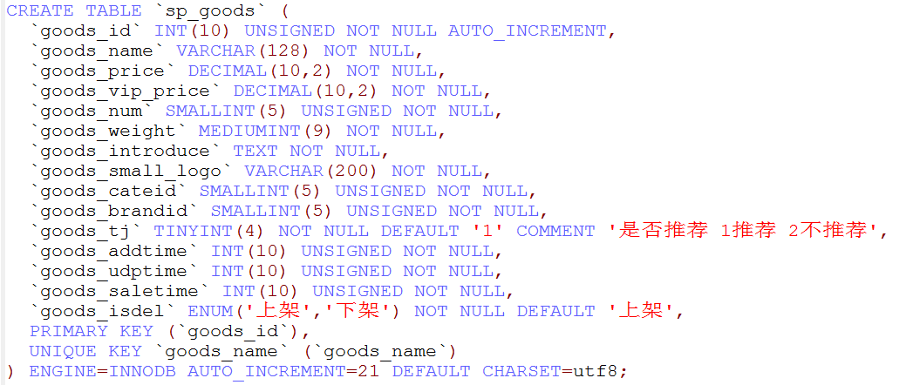
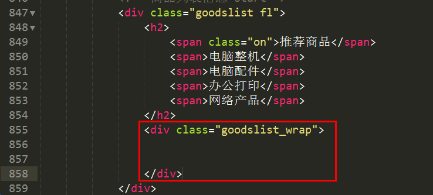
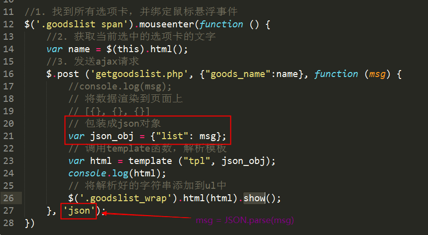
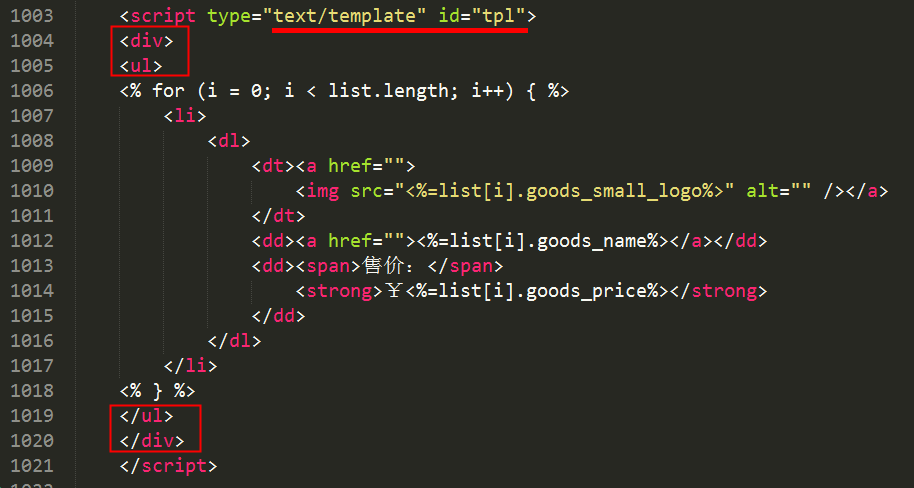
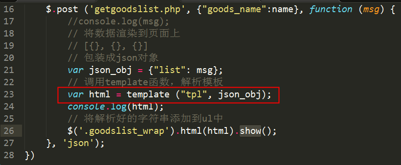
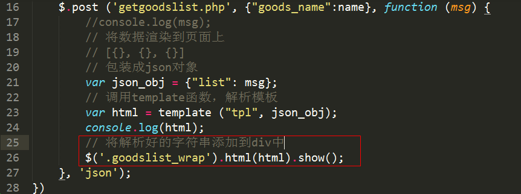
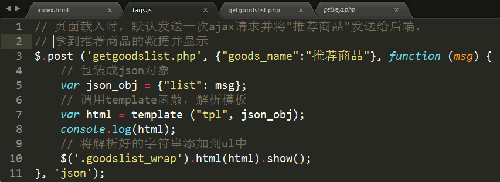

# Ajax技术-3 #

# 1. 文件上传进度条 #

 1) 完成Ajax文件上传

​    核心: Ajax方式上传文件必须使用FormData对象

​    关键点:  
     ① 表单使用提交按钮，一定是button
     ② 获取文件对象 ---- FormData
          i.根据id获取form表单对象 ---- DOM
          ii. 实例化 FormData对象，将表单对象作为参数传入
      iii. 因为使用了FormData，所以一定要用post方式发送请求，将fd作为参数传入send方法


 2) 调整PHP配置文件（php.ini），能够支持大文件上传

   ① PHP配置文件中的两个配置项
       post_max_size: 设置post表单能够上传数据的最大值
       upload_max_filesize:  设置能够上传文件的最大值
   ② ==重启apache==

 3) 编写进度条

   ① 设置进度条所需的div
   ② 文件上传的核心事件  ==xhr.upload.onprogress==  
	onprogress事件大约每100ms触发一次，该事件对象中有 loaded和total两个重要属性
   ③ 计算上传进度，修改进度条样式


代码实现:

 1) 完成Ajax文件上传     -----   FormData
    静态文件 ----  文件上传表单
    动态文件 ----  将上传文件从临时位置移动到目标位置

  

静态文件---upload.html

```
<form id="mainForm">
选择文件: <input type="file" name="pic">
<input type="button" value="上传" id="btn">
</form>

<script type="text/javascript">
document.getElementById('btn').onclick = function () {
    //1. 获取文件对象 --- FormData
    //① 获取form对象
    var fm = document.getElementById('mainForm');
    //② 实话FormData对象
    var fd = new FormData(fm);

    //2. 发送ajax请求
    //① 创建XMLHttpRequest ---- 兼容性函数
    var xhr = new XMLHttpRequest ();

    //④ onreadystatechange
    xhr.onreadystatechange = function () {
        if (xhr.readyState == 4) {
            alert (xhr.responseText);
        }
    }

    //② 准备请求
    xhr.open ('post', 'upload.php');
    //③ 发送请求
    xhr.send (fd);
    
}
</script>
```


动态文件 ---- upload.php

```
<?php 
//print_r($_FILES);
//将上传文件从临时路径移动到目标路径

if(move_uploaded_file($_FILES['pic']['tmp_name'], './'.$_FILES['pic']['name'])){
    echo 1;
} else {
    echo 2;
}
?>
```


upload.html --- 显示结果

```
//④ onreadystatechange
    xhr.onreadystatechange = function () {
        if (xhr.readyState == 4) {
            //alert (xhr.responseText);
            if (xhr.responseText == 1) {
                alert('文件上传成功');
            } else {
                alert('文件上传失败');
            }
        }
    }
```


 2) 调整PHP配置文件，能够支持大文件上传


post_max_size: 设置表单上传的最大数据量


upload_max_filesize: 设置上传文件的最大大小


重启apache。


 3) 编写进度条

   ① 设置进度条所需的div


   ② 文件上传的核心事件  xhr.upload.onprogress  该事件大约没100ms触发一次
       该事件对象中包含了  loaded(已上传大小)和total(总大小)


   ③ 计算上传进度，修改进度条样式

```
xhr.upload.onprogress = function (evt) {
        //console.log(evt);
        // 计算百分比 --- toFixed(2) 只保留小数点后2位
        percent = (evt.loaded / evt.total).toFixed(2);
        // 根据百分比。重新渲染progress的div
        progress_obj.style.width = percent * 300 + "px";
        // 不要将高和背景色使用style写在div中，因为会继承父标签
        progress_obj.style.height = "30px";
        progress_obj.style.background = "red";
        //outer.style.textAlign = "center";
        //outer.innerHTML = percent * 100 + '%';
    }
```


# 2. jQuery提供的Ajax方法 #

 jQuery提供了4个ajax方法:  `$.get()  $.post()  $.ajax()  $.getJSON()`

 前三个常用

##  2.1 $.get ##
 $.get(var1, var2, var3, var4);
  参数1: 请求的后台程序的地址
  参数2: 要发送到后台程序的数据，json对象/js对象
  参数3: 当readyState=4时的触发函数，该函数中有一个参数，就是后台程序返回的数据
  参数4: 设置返回数据的类型:  text(默认)  json     xml

示例:  

```
$.get('getData.php', {"goods_id":10101, "_":Math.random()}, function(msg){
	alert(msg);
}, 'json');
```

​	 

解析:   上面的代码等价于原生js的

```
var xhr = new XMLHttpRequest();
xhr.onreadystatechange = function(){
	if(xhr.readyState == 4){
		msg = xhr.responseText;
		msg = JSON.parse(msg);
		alert(msg);
	}
}
xhr.open('get', 'getData.php?goods_id=10101&_='+Math.random());
xhr.send(null);
```

​     

使用jquery提供的ajax方法，就是为了简化开发。

   


##  2.2 案例 --- 搜索框下拉列表 ##


数据表设计:


key_id: 主键

key_name: 关键词


 思路分析:

1. index.html

   1) 在搜索文本框上绑定键盘弹起事件

   2) 事件函数

      ① 获取搜索框内容

      ② 发送ajax请求，等待结果

2. getKeys.php

   1) 接收关键词

   2) 编写SQL语句并进行查询

   3) 将查询结果返回给前端

3. index.html

   接收后端返回结果并显示

   ① 每天向tips中填充数据时，都要先清空tips
   ② 每次从后端返回结果中取出数据时，都要创建一个div，再将数据填入div，再给div绑定鼠标悬浮事件、移出事件、点击事件
   ③ 将div追加到tips中
   ④ 将tips显示出来

   ​


代码实现:

index.html

```
//1. 在文本框上绑定键盘弹起事件
$('.txt').keyup(function () {
	//2. 获取文本框值
	var key = $(this).val();
	//3. 发送ajax请求，并将值一起发送给后端页面
	//参数1: 请求的后台程序地址
	//参数2: 发送到后台的参数 --- json/js
	//参数3: readyState=4时的回调函数，函数中的参数就是后端程序返回的数据 responseText
	//参数4: 设置返回值类型 默认 text
	$.get('getkeys.php', {"key": key, "_":Math.random()}, function (msg) {
		console.log(msg);
	})
})
```


关键点总结:

1) 使用键盘弹起事件来触发ajax请求

   ① 获取搜索框中的内容

   ② 发送ajax请求，并将搜索框中的内容一起发送给后端

2) 接收到的数据需要循环显示在下拉菜单中

   ① 将返回的字符串转为数组（内部是json对象）

   ② 循环数组，取出每一个相似关键词

   ③ 在循环中创建div对象，将关键词加入div对象

   ④ 在div上绑定鼠标悬浮事件，修改背景和字体颜色

   ⑤ 在div上绑定鼠标移出事件，修改背景和字体颜色为初始颜色

   ⑥ 将div追加到下拉列表中，然后显示出来

   ⑦ 在div上绑定点击事件，将内容写在搜索框中，并隐藏下拉列表

   ⑧  在循环显示下拉列表之前先清空下拉列表中已有内容


getkeys.php

```
<?php 
//1. 接收前端发送的数据
$key = $_GET['key'];

//2. 拼接SQL语句并执行
$sql = "select * from goods_key where key_name like '%$key%'";

$conn = mysqli_connect('localhost', 'root', 'root');
mysqli_select_db($conn, 'exp');
mysqli_query($conn, 'set names utf8');
$result_obj = mysqli_query($conn, $sql);

//因为$result_obj会包含多条数据，所以将其转为二维数组
$arr = array();
while ($row = mysqli_fetch_assoc($result_obj)) {
    $arr[] = $row;
}

//3. 将结果返回给前端
echo json_encode($arr);
?>
```


index.html

1)  完成下拉列表

```
<style type="text/css">
.tips {
	position: absolute;
	top:36px;
	left:-2px;
	width: 504px;
	height: 100px;
	border: 2px solid red;
	z-index: 999999;
	background: white
}
</style>
```


2) 将接收到数据填充到下拉列表中

```
$.get('getkeys.php', {"key": key, "_":Math.random()}, function (msg) {
		//console.log(msg); 
		//msg = [{"key_id":1, "key_name":"华为"},{"key_id":2, "key_name":"华为 pro"}]
		//循环将key_name的值取出，填写到tips的div中
		//获取tips的div
		var tips = $('.tips');
		//向tips中追加内容时，应该先清空原有数据
		tips.empty();
		for (var i = 0 ;i < msg.length; i++) {
			//alert(msg[i].key_name);
			// 为每一个关键词创建一个div，再将关键词写入div，再将div追加到tips
			//① 创建div
			div_obj = $('<div>');
			//② 将关键词写入div
			div_obj.html(msg[i].key_name);
			//为每一div绑定鼠标悬浮事件，让div高亮显示
			div_obj.mouseover(function () {
				$(this).css({'background':'pink'})
				//绑定鼠标移出事件，取消高亮显示
			}).mouseout(function () {
				$(this).css({'background':''})
				//点击事件，将选中内容填写到文本框中，并且让下拉列表消失
			}).click(function (){
				$('.txt').val($(this).html());
				tips.hide();
			})
			//③ 将div追加到tips中
			tips.append(div_obj);
		}
		tips.show();
	}, 'json')
```


##  2.3 $.post ##
`$.post`函数的用法和`$.get`一模一样，只是发送请求方式变为post

 $.post(var1, var2, var3 , var4);    //最标准的写法
  参数1: 请求的后台程序的地址
  参数2: 要发送到后台程序的数据，json对象/js对象
  参数3: 当readyState=4时的触发函数，该函数中有一个参数，就是后台程序返回的数据
  参数4: 设置返回数据的类型:  text(默认)  json     xml


示例: 

```
$.post('getData.php', {"goods_id":10101}, function(msg){
	alert(msg);
}, 'json');
```

​	 

解析:   上面的代码等价于原生js的

```
var xhr = new XMLHttpRequest();
xhr.onreadystatechange = function(){
	if(xhr.readyState == 4){
		msg = xhr.responseText;
		msg = JSON.parse(msg);
		alert(msg);
	}
}
xhr.open('post', 'getData.php');
var param = 'goods_id=10101';
xhr.setRequestHeader('content-type', 'application/x-www-form-urlencoded');
xhr.send(param);
```


##  2.4 案例 --- 选项卡切换 ##


思路分析:


数据表设计:



重点关注字段：

 goods_name : 商品名称
 goods_price :  商品价格
 goods_small_logo : 商品图片
 goods_tj: 是否为推荐商品
 goods_cateid: 商品所属分类，例如：电脑类，电子产品类等

1.index.html
  1) 在每个选项卡上都要绑定鼠标悬浮事件，用来触发ajax请求
  2) 事件函数
     ① 获取当前选项卡名称
     ② 发送ajax请求，并将选项卡名称一起发送给后端

2.getgoodslist.php
  1) 接收选项卡名称
  2) 根据选项卡名称编写SQL语句
  3) 执行查询
  4) 将结果返回给前端

3.index.html
  接收后端返回数据，使用模板进行显示
  1) 接收后端数据
  2) 使用模板显示数据
    ① 引入template-web.js文件
    ② 定义模板
    ③ 调用template函数解析模板
    ④ 将解析好的字符串渲染到页面
    ⑤ 调用show方法进行显示


1.index.html

```
//1. 找到所有选项卡，并绑定鼠标悬浮事件
$('.goodslist span').mouseenter(function () {
    //2. 获取当前选中的选项卡的文字
    var name = $(this).html();
    //3. 发送ajax请求
    $.post ('getgoodslist.php', {"goods_name":name}, function (msg) {
        alert(msg);
    })
})
```


2. getgoodslist.php

   使用模板引擎来进行渲染

   1) 引入template-web.js库文件
   2) 定义显示最终结果标签

   

   3) 定义模板

     ① 将接收到结果包装成json对象

   

     ② 定义模板

   

   4) 调用template函数解析模板

   

   5) 将解析结果，显示到页面上

   

3.补充页面第一载入时，默认向推荐商品选项卡中添加数据




##  2.5 $.ajax ##
 `$.ajax`使用JS对象来配置ajax请求  ---  $.ajax(obj);

 必须配置项：
  url:         要请求的后台程序地址
  data:      要发送到后台程序的数据 (建议使用json对象格式)
  type:      请求类型  post和get 两种
  dataType:  返回值类型  text(默认) 、 json 、xml 、 jsonp(跨域使用) 
  success:   成功完成ajax触发的事件，回调函数，其参数是后端程序的返回数据

简单案例:

```
<script type="text/javascript">
$.ajax({
    url: 'ajax.php',
    data: {"id":10001, "name":"zs"},
    type: 'post',
    dataType: 'json',
    success: function (msg) {
        console.log(msg);
    }
});
</script>
```

```
<?php 
echo json_encode($_POST);
?>
```


 其他配置项：

  cache: 是否进行缓存(true/fasle)，如果设置type为get，一般设置该项为false(不缓存)。
  async: 同步/异步设置，true(异步、默认) false(同步)。
  timeout: 超时设置，多少ms之后扔未接收到后端返回数据，则结束本次请求。
  error: 请求失败时的回调函数，该函数有三个参数。参数1是xhr对象，参数2是错误信息（错误信息通常是 "null", "timeout", "error", "notmodified" 和 "parsererror"），参数3是异常对象。
  complete: Ajax完成时的回调函数。
  beforeSend: 发送Ajax之前执行的回调函数。

  contentType:  头信息设置，使用FormData对象时设置该值为false，其他情况会自动设置，不需要手动设置。
  processData:  处理数据方式，使用FormData对象时设置该值为false，其他情况会自动设置，不需要手动设置。

  注意: ==contentType和processData只有在使用FormData对象时设置，其余情况均不用设置==


```
$.ajax ({
    url: 'ajax-1.php',
    data: {"color":"red"},
    type: 'get',
    cache: false, // false不缓存 true缓存
    async: false,  // true异步  false同步
    timeout: 1000, //1秒以内要接收到后台返回数据
    dataType: 'text',

    success: function (msg) {
        alert(msg);
    },
    error: function (xhr, errMsg, e) {
        console.log (errMsg);
    },
    complete: function () {
        console.log ("请求完成之后必然会执行该方法");
    },
    beforeSend: function (){
        console.log ("请求发送之前执行的方法");
    }
});
```


##  2.6 案例 --- 添加新管理员

目标: 通过表单提交向ali_admin数据表中写入一条新数据


