# Ajax技术-2 #
# 1. 案例 --- ajax评分 #
1)整体目标:
 ① 鼠标在星星上悬浮时，可以调整明暗
 ② 鼠标点击时，可对该电影进行评分


2) 思路分析:

 content.php --- 前端页面，因为要从数据表中读取电影信息，所以使用php
   ① 鼠标悬浮在某个星星上时，悬浮点之前的星星全是亮的，悬浮点之后的星星全是暗的 --- 通过调整img引入的图片即可实现
   改变批量绑定事件的方式： 原来是$('#rank_pic img').mouseenter() ---> 一个一个绑定 ,因为需要下标
    $('#rank_pic img').each(function (==index==) {

​	$(this).mouseenter()

​    })
   ② 鼠标在某个星星上点击时，计算分数，发送ajax请求，并将分数一起发送到后端页面

​	（index + 1） * 0.5

​         发请求时，将分数和id一起发送给后端


 rank.php  ---  后端计算评分页面
   ① 接收前端发送的分数
   ② 编写修改评分的SQL语句并执行
   ③ 将修改后的评分和评分人数返回给前端页面


 content.php
   ① 接收后端页面返回的评分和评分人数
   ② 将评分和评分人数渲染到页面上


 3) 数据表设计

```
CREATE TABLE `movie` (
  `id` int(10) unsigned NOT NULL AUTO_INCREMENT comment '电影id',
  `title` varchar(30) NOT NULL comment '电影标题',
  `rank` float(3,1) DEFAULT NULL comment '电影评分',
  `num` int(10) unsigned DEFAULT NULL comment '评分人数',
  PRIMARY KEY (`id`),
  UNIQUE KEY `movie_title` (`title`)
) ENGINE=MyISAM AUTO_INCREMENT=2 DEFAULT CHARSET=utf8;

INSERT INTO `movie` VALUES ('1', '魔侠传之唐吉可德', '8.5', '15');
```


代码实现：


4) 关键点和易错点总结

  ① 每一个星星是由左右两半组成的，左边亮色为rank_1.jpg，暗色为rank_3.jpg； 右边亮色为rank_2.jpg，暗色为rank_4.jpg。 鼠标悬浮移动时就是调整 img 标签src引入的图片
     亮:  rank_3.gif --> rank_1.gif     rank_4.gif ---> rank_2.gif
  ② 获取所有的img对象 --- $('#rank_pic') ，为所有的img对象绑定鼠标悬浮事件时，需要使用each方法将其一个一个取出，再一个一个绑定悬浮事件。 因为后面计算分数时，需要悬浮点的索引下标，而each方法能提供。
  ③ 点击某个星星时，要获取对应的索引，然后计算分数；再发送ajax请求；ajax请求中需要两个参数：评分和电影id
  ④ 后端接收评分和电影id后，即可编写SQL语句进行数据表修改操作。之后需要再执行一个SQL语句，从数据表中取出最新的评分和评分人数，组成数据，再转为json字符串返回给前端。
  ⑤ 前端接收评分和评分人数后，使用dom操作将最新的评分和评分人数填写到页面对应的位置。


# 2. 自己封装Ajax --- 和jQuery一样 #
从一般到通用。
从一个具体的案例，完善成一个兼容相同功能函数
  1) 编写一个具体案例
  2) 分析其中的缺陷
  3) 完善缺陷

## 2.1 封装 $.get方法 ##
1) 编写一个具体的案例
   具体案例:  封装一个get方法，能够发送ajax请求，请求1.php文件，并且能接收到1.php的返回数据
 ① 一般方法

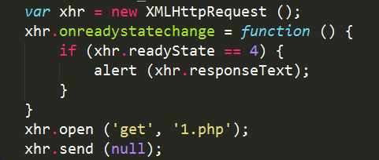

 ② 封装成对象和方法

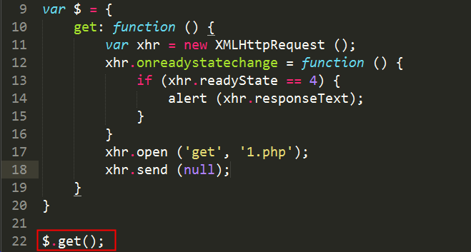


==分析具体案例存在的问题，一步一步将存在问题修正，就能够形成一个通用的函数了。==

具体案例存在的问题:
① 在创建XMLHttpRequest对象时，没有处理浏览器兼容性
② 只能访问1.php程序
③ 无法灵活向后台的1.php程序发送参数
④ 前端无法灵活接收后端返回的数据
⑤ 返回值类型单一，只能使用字符串


2) 处理创建XMLHttpRequest对象时的兼容性问题

① 封装创建 XMLHttpRequest对象的方法

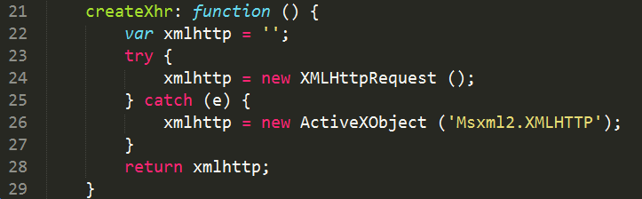

② 在get方法中调用

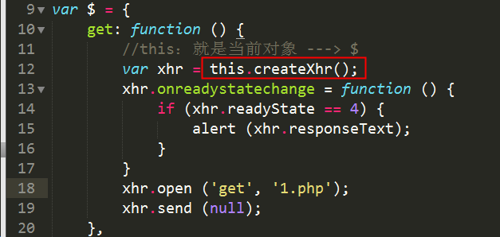


3) 处理只能访问1.php文件的文件的问题。
  思路: 定义get函数时设置形参，调用函数时传递实参
  ① 方法中定义形参
  ② 在调用$.get方法时，传入实参

1


4) 处理请求后台文件时无法发送数据 
  思路: 将js对象组装为字符串，拼接在请求的url地址之后
  ① 定义parmas方法，将json对象处理成字符串

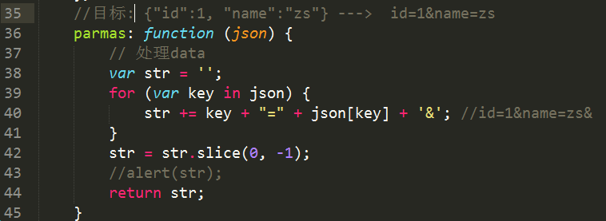

  ② 在get方法中增加参数
  ③ 在调用 $.get方法时，要传入参数2

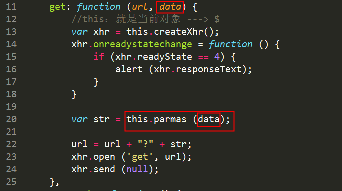


5) 处理readyState=4时的回调函数
 ① 在get方法中定义形参，使用该形参时，增加() 则变为函数，并且要将xhr.responseText作为参数传入

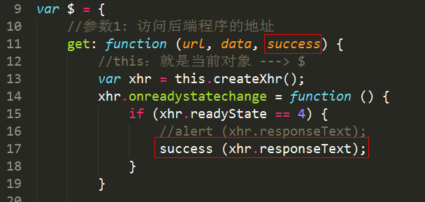


 ② 调用$.get方法时，要传入参数3

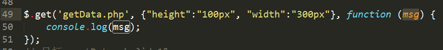


6) 处理能够接收不同类型的返回值
 ① 在$.get方法定义中，增加最后一个参数
 ② 在回调函数中判断最后一个参数的值，如果是json则调用JSON.parse

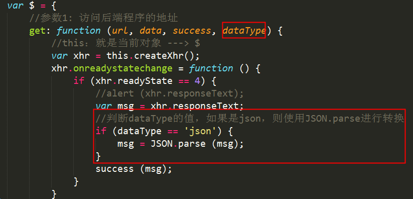

 ③ 调用 $.get方法时，加入最后一个参数

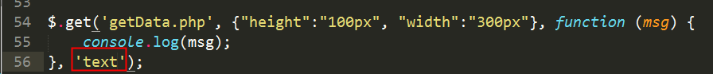


## 2.2 封装 $.post方法 ##
 1) 创建post方法，能够发送ajax请求
 2) 处理向后台发送的数据
 3) 处理回调函数和返回值类型

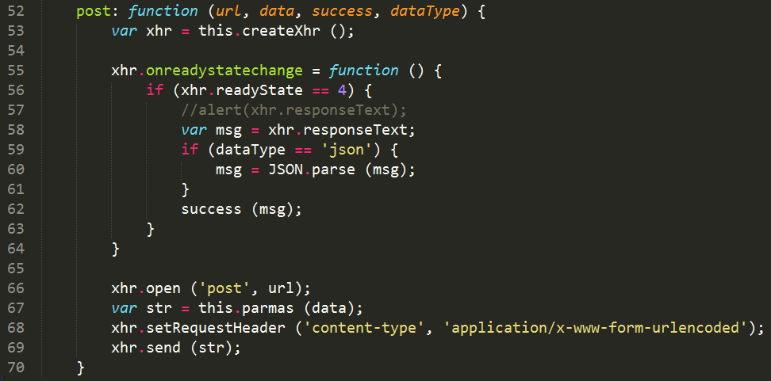


## 2.3 封装 $.ajax方法 ##
 核心思想:
1)将发送请求的地址、方式、数据、返回值类型、回调函数都封装到js对象中，然后作为参数传入$.ajax方法中。
2)在$.ajax方法中区分post和get方式，分别调用get方法和post方法。

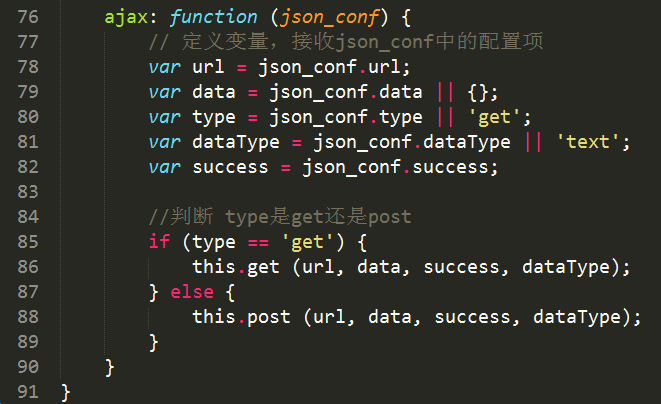


# 3. 虚拟主机配置 #
## 3.1 什么是虚拟主机 ##
虚拟主机，也叫“网站空间”，就是把一台运行在互联网上的物理服务器划分成多个“虚拟”服务器，每一个虚拟服务器都能独立运行一个网站


## 3.2 虚拟主机配置3步骤

1) 修改apache配置文件(httpd.conf)，引入apache的虚拟主机配置文件(httpd-vhost.conf)
     去掉该句前的 # 号


2) 修改虚拟主机配置文件
d:\phpstudy\Apache\conf\extra\httpd-vhosts.conf

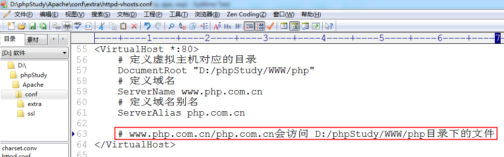


3) 修改host文件 (使用管理员权限修改)
c:/windows/system32/drivers/etc/host 

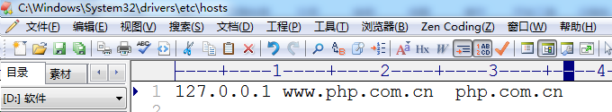


==重启Apche服务器==

# 4. ajax跨域 #
##  4.1 什么是ajax跨域 ##
简单来说，就是网站A去调用网站B的数据。
常见案例： hao123.com的天气预报。


但是Ajax跨域存在一个问题 --- 浏览器的同源策略，该策略会阻止ajax跨域访问
同源策略（Same origin policy）是一种约定，它是浏览器的一种安全功能。 
同源:  同协议，同域名，同端口；   不同源则为跨域

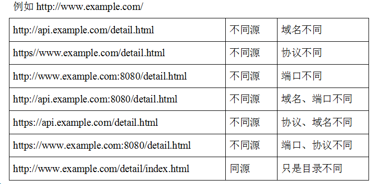


同源限制案例:
www.study.com/origin/index.html使用ajax，请求www.demo.com/1.php文件中的数据

1) 创建 www.study.com/origin/index.html 文件

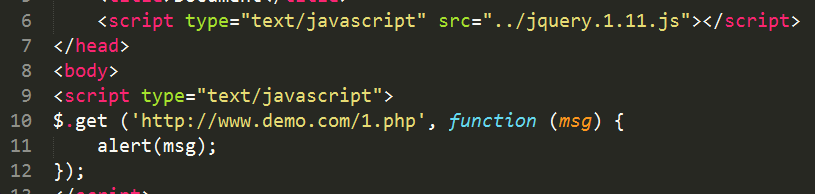

2) 创建 www.demo.com/1.php

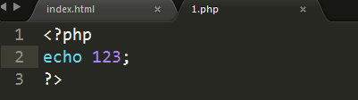

访问结果:

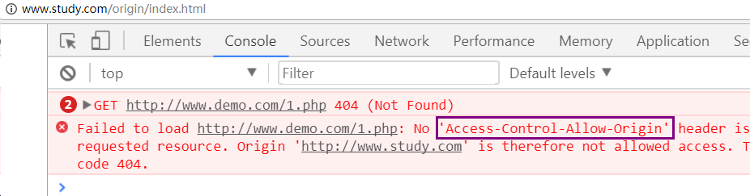

看到错误中有  Access-Control-Allow-Origin 就说明你的跨域请求被阻止


解决跨域问题有三种方式：

- 服务器代理
- cors
- jsonp


##  4.2 代理实现ajax跨域 ##
  核心思想:  php中有一个函数  ==file_get_contents==。 该函数能够获取到其他网站的数据。

  file_get_contents('http://www.baidu.com/index.html');

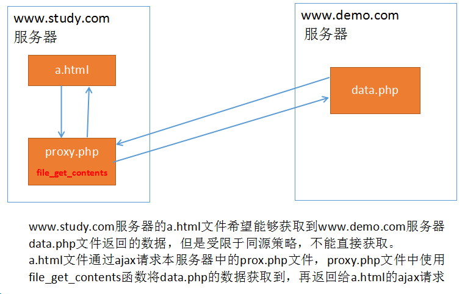

案例: 
www.study.com/proxy/a.html发送ajax请求，请求www.study.com/proxy/proxy.php文件
proxy.php文件使用file_get_contents函数读取www.demo.com/data.php文件中的内容，再返回给a.html文件中的ajax请求

1)创建  www.study.com/proxy/index.html


2)创建  www.study.com/proxy/proxy.php 


3)创建  www.demo.com/a.php

访问结果:


##  4.3 cors跨域 ##
  cors: 跨域资源共享。
  同源策略是浏览器的策略。但是如果服务器允许其他网站的页面进行跨域访问，那么浏览器就不会对返回的数据进行限制了。

  ==核心方法: 在服务器端(PHP文件中)声明不用进行同源限制==

如果设置为 * 则是所有外部网站都可以获取数据
header('Access-Control-Allow-origin: *'); 

只允许www.study.com网站访问并获取数据
header('Access-Control-Allow-origin: http://www.study.com'); 

案例:
www.study.com/cors/index.html通过cors方式，访问www.demo.com/cors.php文件的数据	
1)创建 www.study.com/cors/index.html文件 发送ajax请求

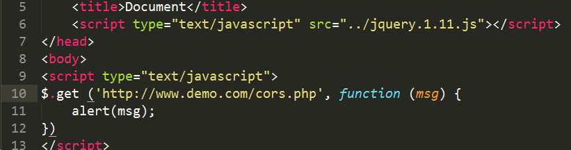

2)创建 www.demo.com/a.php

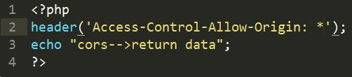


##  4.4 jsonp跨域 ##
JSONP(JSON with Padding) : 是一种解决ajax跨域访问的方案。

核心思想:
   浏览器虽然有同源策略，但是 src 和 href 两个属性却可以跨域访问。 可以利用这一“漏洞”发送ajax请求。

案例: 
www.study.com/jsonp/index.html文件中通过script标签的src属性，跨域访问www.demo.com/jsonp.php文件中的数据

1) 创建 www.study.com/json/index.html ,使用 script标签引入了  www.demo.com/jsonp.php文件

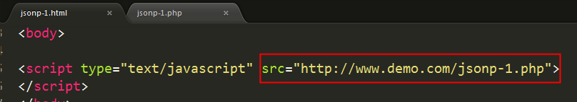

2) 创建 www.demo.com/jsonp.php文件 输出个 123

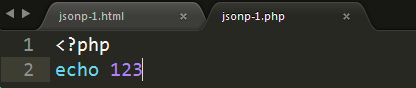

​    访问结果: 能接收到123，但是无法正常显示

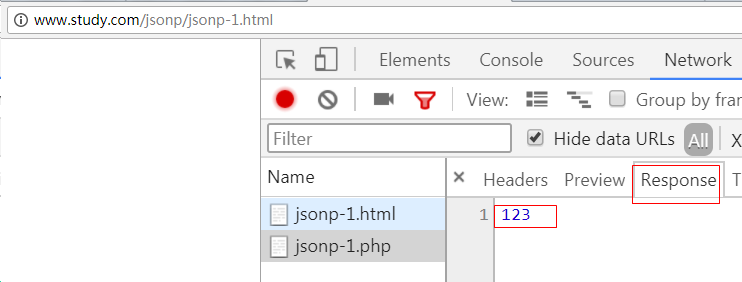


3) 调整后台返回数据的方式 --- 返回了一个 ==函数字符串 例如: 'aaa(123)'== 

 所以，此时前端接收的到就是 aaa(123); 相当于执行了 aaa() 函数

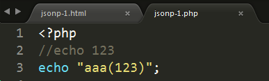


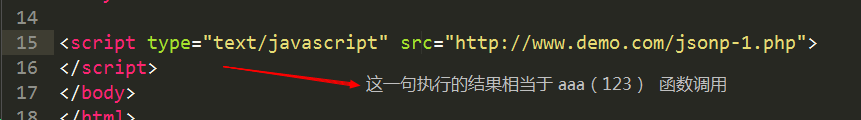

4) 在前端页面提前定义好 函数 aaa()

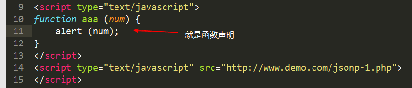


5) 丰富一下后台返回数据的类型

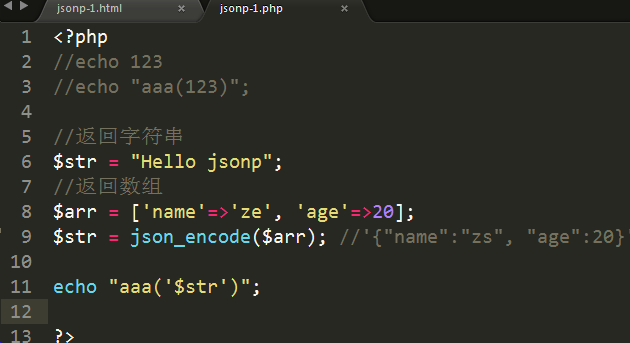


##  4.5 $.ajax方法跨域操作 --- jsonp方式 ##
核心: 
    必须设置请求类型为get ---  type: ‘get’
    必须设置dataType为jsonp --- dataType: ‘jsonp’
    必须额外设置一个jsonp参数，该参数值可以是任何英文字符串，常用callback。==该函数的作用是在前端自动创建一个以该字符串为名称的函数名==

示例:

1) 使用jsonp发送跨域请求

```
$.ajax({
    url: 'http://www.study.com/test/2.php',
    type: 'get',   
    dataType: 'jsonp',   
    jsonp: 'callback',        
    success: function(msg){
        alert(msg);
        alert(msg.name);
    }
})

```


2) 后端拼接函数字符串

```
<?php 
// 函数名
$callback = $_GET['callback'];
$str = "$.ajax--->jsonp";
echo $callback . "('$str')";
?>
```

案例:
www.study.com/jquery_jsonp/index.html跨域访问www.demo.com/jquery_json.php文件中的内容

1)　创建 www.study.com/jquery_jsonp/index.html 发送ajax请求

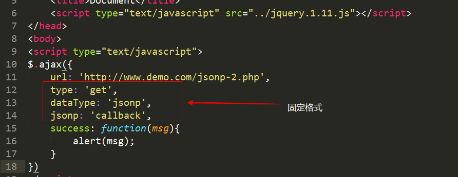

 type：‘get’

dataType: 'jsonp'

jsonp: 'callback' 
以上三句固定格式。  success函数中如果将数据渲染到页面是灵活的


2)　创建www.demo.com/jquery_json.php 返回数据

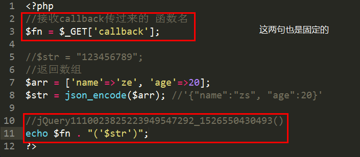


 `$fn =$_GET['callback']；   `

  `echo $fn . "('$str')";`

 以上两句固定。 
 中间产生数据的方法灵活

