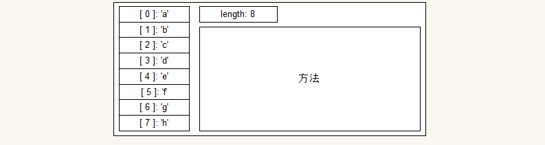

# jQuery 基础

# 1.1 jQuery 简介

jquery 是比较早的 js 库, 但是作为初学者, 它是进阶的一个好助手:

**代码举例**

### 事件操作举例

原生 JavaScript 事件操作:

```javascript
var btn = document.getElementById( 'btn' );
btn.onclick = function () {
    // 代码逻辑
};
```

jQuery 的事件操作

```javascript
$( '#btn' ).click(function () {
    // 代码逻辑
});
```

### 样式操作举例

原生 JavaScript 样式操作:

```javascript
var dv = document.getElementById( 'dv' );
dv.style.width = '200px';
dv.style.height = '100px';
dv.style.border = '1px solid red';
dv.style.backgroundColor = 'pink';
```

jQuery 的样式操作:

```javascript
$( '#dv' ).css({
    width: '200px',
    height: '100px',
    border: '1px solid red',
    backgroundColor: 'pink'
});
```

这样类似的案例很多, 我们后面还会看到. 下面对 jQuery 的一些特点做一个简单小结.

结论: 

- jQuery 提供了方便简洁的 API
- jQuery 给初学者屏蔽了浏览器的差异
- jQuery 源代码相对容易

所以作为进阶程序与开发, 使用 jQuery 是非常容易的.


## 1.1.2 jQuery 与 JavaScript 的关系

JavaScript 是操作 页面 的基础语言, 是根本. 

jQuery 是使用 JavaScript 对**常用的代码**, **繁琐的算法**, **兼容**等问题进行了封装. 使我们:

- 使用很少的带了, 能做更多的事情
- 能使用一种 调用 方式, 适应几乎所有的浏览器
- 代码编写的节奏更加流畅, 连贯

事实上除了 jQuery, 还有非常多的优秀的库. 可以到下面站点去看看: 

[https://www.awesomes.cn/](https://www.awesomes.cn/)


## 1.1.3 jQuery 就是一个方便的 JavaScript 的库

jQuery 的官网是: [http://jquery.com/](http://jquery.com/)


点击页面中的 download 下载 jQuery


下载后, 使用 script 引入即可使用了, 例如:

```html
<script src="./jquery/jquery-3.3.1.js"></script>
```


# 1.2 jQuery 基础语法

学习 jQuery, 我们先初步介绍一些方法, 不做过多解释, 然后在使用过程中, 我们再深入到每一个细节中.


## 1.2.1 jQuery 顶级函数

jQuery 是对 JavaScript 的封装. 为了方便使用, 采用了对象的方式进行包装. 在 jQuery 中有一个**顶级对象**, 即

```javascript
jQuery 
// 或
$
```

它们是同一个东西, 只是定义了两个名字而已. 使用名字 `jQuery` 的地方发, 也可以完全替换成名字 `$`.

打印一下可以看到:


在 jQuery 中, 所有的操作都来源于这个顶级对象.

- 首先, **它是一个函数**, 使用它可以对页面中的元素进行查找, 转换等操作.
- 同时它也是一个对象, **包含很多工具方法**.

### 1) 获得元素

CSS 的选择器可以很方便的定位元素, jQuery 也设计了这个方法来获得元素, 而且采用的语法与 CSS 一样. 

要使用 jQuery 获得元素, 使用语法:

```javascript
$( '选择器' )
// 或
jQuery( '选择器' )
```

说明:

- 该方法无论使用 $ 还是 使用 jQuery 都可以.
- 选择器用来匹配元素, jQuery 会将符合选择器的元素全部找到.
- 该方法会返回一个复杂的数据: 包含所有匹配到的 DOM 对象, 以及很多方法.
- 一般将该方法返回的数据称为 **jQuery 对象.** 
- 为了以示区分, 一般 jQuery 对象的变量使用 $ 开头.

**复习 CSS 的基础选择器**

- css 中 id 选择器使用 **井号** 开头, 例如 `#dv` 
- css 中类型选择器使用 **点号** 开头, 例如 `.cname`
- css 中标签选择器直接使用标签名即可, 例如 `div`, `table`
- css 中还有一个通用选择器, 就是 `*`, 表示任意元素

在 jQuery 中也是如此, 要获得元素也是使用这样的语法.


**案例**: 获得页面元素, 并打印出来

```html
<div>我是 div 标签</div>
<p>我是 p 标签</p>
<p class="cp">我是使用了类样式 cp 的 p 标签</p>
<div>我是 div 标签</div>
<p>我是 p 标签</p>
<div>我是 div 标签</div>
<p class="cp">我是使用了类样式 cp 的 p 标签</p>
<div>我是 div 标签</div>
<p id="idp">我是使用了 id 为 idp 的 p 标签</p>
<p class="cp">我是使用了类样式 cp 的 p 标签</p>
```

添加一些样式后


分别获得元素

```javascript
// 利用 标签选择器 获得元素
var $dvs = $( 'div' );

// 利用 id 选择器 获得元素
var $idp = $( '#idp' );

// 利用 类选择器 获得元素
var $cp = $( '.cp' );
```

注意:

- 可以使用 $ 也可以使用 jQuery
- 使用选择器的时候, $ 函数中的参数是**字符串**
- 一般使用带有 $ 前缀的变量作为接收变量


**小结**

jQuery 可以使用的 **基础**选择器

| 选择器          | 含义                            | 示例                                 |
| ------------ | ----------------------------- | ---------------------------------- |
| `#id`        | id 选择器, 用于获得对应 id 的元素         | `$('#dv')` 或 `jQuery( '#dv' )`     |
| `.className` | 类选择器, 用于获得所有使用了该类样式的元素        | `$( '.btn' )` 或 `jQuery( '.btn' )` |
| `div`        | 标签选择器, 直接使用标签名, 用于获得该标签元素     | `$( 'div' )` 或 `jQuery( 'div' )`   |
| `*`          | 通用选择器, 用于获得所有元素, **一般很少直接使用** | `$( '*' )` 或 `jQuery( '*' )`       |


### 2) jQuery 是对 JavaScript 的封装

将上述获得的代码打印出来:


从结果可以看到:

- jQuery 获得了所有符合要求的元素
- 所有的元素是以伪数组的形式返回

事实上, 返回的结果我们常常称为 **jQuery 对象**. 因为它除了包含所有符合的元素外, 还提供了很多方法:


因此我们可以发现:

- jQuery 就是将 DOM 对象进行了包装. 即 利用 JavaScript 进行的封装.
- jQuery 对象提供了很多的方法. 这些方法就是来操作伪数组中的这些 DOM 对象的.

那么, 怎么操作呢? 我们下面慢慢来了解.


### 3) ready 方法

在传统的 JavaScript 代码中, 如果需要将 JavaScript 的代码写在页面的上方, 一般需要给 window 来注册 load 事件

```javascript
window.onload = function () {
    // 代码 ...
};
```

那么使用这个方法有几个缺陷:

1. on 方法添加的事件没有办法追加, 也就是说 onload 函数会比较庞大
2. 虽然可以使用 addEventListener, 但是单词太长, 不方便.
3. 页面加载事件中, window 的 load 事件, 会等到页面中的所有数据加载完成后触发.

jQuery 提供了一个非常方便的处理办法, 语法如下:

```javascript
$( document ).ready( function () {
    // 代码 ...
} );
// 或者 更简单
$( function () {
    // 代码 ...
} );
```

说明:

- 这两个语法结构功能一样, 使用哪一个都可以.
- jQuery 的方式会在页面 DOM 加载完毕以后, 立即执行逻辑, 而无需等待其他资源加载完毕.
- 而传动的 window.onload 方式, 会等到页面完全加载完所有数据后才会触发. 

**代码验证(看文件夹)**

*注意: 需要安装 node 环境*


## 1.2.2 jQuery 对象与 DOM 对象

**注意: 有必要复习一下 面向对象的 思想.**

### 1) 为什么需要 jQuery 对象

前面已经了解到 jQuery 就是对 DOM 进行了封装. 那么我们为什么需要提供一个 jQuery 对象呢?

考虑一下需求:

1. 获得元素
2. 设置元素样式

按照我们的逻辑代码应该怎么实现呢? 

例如我们可以考虑统一获得元素的方法( **思路** )

```javascript
function s( selector ) {
    return document.querySelectorAll( selector );
}
```

如此一来, 可以容易按照选择器来获得元素. 但是这还不够.

1. 我们需要处理事件的功能
2. 需要处理属性的功能
3. 需要处理样式的功能
4. 等等 ...

我们发现要处理这里的所有元素, 必须使用循环... 

- 代码繁冗, 一层不变

因此我们可以利用 **面向对象的思想** 来组织代码.

- 对象存储数据, 即存储匹配的 DOM 对象
- 对象提供操作数据的方法, 即操作 存储 的 DOM 对象

所以就有 jQuery 对象了.


### 2) jQuery 对象的本质

类似于 JavaScript 内置的对象, 例如数组

1. 存储各项数据, 使用 length 属性描述数组长度, 使用下标访问各项
2. 对象 "持有" 很多方法, 来操作存储的所有数据

打开调试器, 打印一个 jQuery 对象即可看到 **jQuery 对象就是存储 DOM 对象的一个伪数组**.

例如存储字符串的数组

```javascript
var arr = [ 'a', 'b', 'c', 'd', 'e', 'f', 'g', 'h' ];
```

其存储逻辑可以看成:



其中:

- 图中左边的一列, 就是数组中的各个项. 存储的是各个字符串.
- 然后数组有一个 length 属性, 用于表示数组的长度. 即存储了多少元素.
- 然后是一个特殊的区域( 大家应该知道, 就是原型 )存储各种方法.

而 jQuery 对象也是如此. 例如下面的页面:

```html
...
<body>
    <div class="c"></div>
    <div class="c"></div>
    <div class="c"></div>
    <div class="c"></div>
</body>
...
```

使用 jQuery 获得元素后:

```javascript
var $div = $( '.c' ); // 使用类选择器, 亦可使用其他选择器
```

其内存逻辑可以看成


可以发现其逻辑结构与数组结构一模一样.

- 图中左边的一列是存储的 DOM 对象. 利用 类选择器 获得了 4 个元素.
- 然后, 该对象含有一个 length 属性, 用于表示该对象中存储 DOM 对象的个数.
- 最后, 该对象也包含很多方法. 

所以, **jQuery 对象实际上就是一个 存储 DOM 元素的, 包含各种操作方法的伪数组.**


### 3) 互相转换

了解了 jQuery 对象的本质, 那么我们就很容易将 jQuery 对象转换成 DOM 对象了.

**注意: 为什么需要转换?**

1. 我们刚刚开始学习 jQuery, 很多方法需要慢慢介绍, 为了实现案例, 可以使用 jQuery 与 原生 JS 代码混编
2. 少数情况下, jQuery 的代码也会很麻烦, 因此少数情况下会在 jQuery 中使用原生 JS 代码
3. 多数情况下 jQuery 的代码比 原生 代码简单, 好维护, 所以一般也会将原生 DOM 对象转换成 jQuery 对象.

**将 jQuery 对象转换成 DOM 对象**

```javascript
$obj[ index ]
// 或
$obj.get( index )
// 或
$obj.get()
```

说明:

- 由于 jQuery 本质就是一个伪数组, 因此直接使用下标即可获得其中的 DOM 元素
- jQuery 提供了一个方法, get, 传入索引序号, 也可以实现获得对应的 DOM 元素
- 如果 get 方法不带参数, 就表示获得所有的 DOM 对象, 并以**真数组**的形式返回


**案例演示**

点击按钮, 切换 div 背景色.

说明:

1. 我们还没有学习其他方法, 所以, 可以考虑使用 jQuery 获得元素, 然后将其转换成 DOM 对象
2. 利用 DOM 对象操作样式的方法来实现该案例

```html
<!-- html 片段 -->
<style>
    .box {
        width: 200px;
        height: 150px;
        border: 1px solid blue;
        background-color: pink;
    }
</style>
</head>
<body>
    <button id="btn">点击切换颜色</button>
    <div class="box"></div>
</body>
```


**将 DOM 对象转换成 jQuery 对象**

前面已经介绍了( 虽然还没有给大家演示 ), jQuery 给我们提供了**非常多的**, **简洁的**, **好用的**方法. 

所以经常也会将 DOM 对象转换成 jQuery 对象俩使用( 后面会演示, 先记住如何操作 ).

可以使用下面语法:

```javascript
$( DOM 对象 )
// 或
jQuery( DOM 对象 )
```

说明:

- 该方法需要一个参数, 即 DOM 对象
- 该方法返回 "包装" DOM 对象的 "伪数组"
- jQuery 的顶级函数可以支持很多参数, 我们后面会一一介绍. 已经介绍过的有:
  1. 选择器字符串
  2. DOM 对象

简单演示

```javascript
var dv = document.getElementById( 'dv' );
var $dv = $( dv );
console.log( $dv );
```


### 4) 小结

1. jQuery 只是一个 JavaScript 的 **函数库**
2. jQuery 将 DOM 进行了包装, 得到 jQuery 对象, 其目的是可以提供更多的方法操作
3. jQuery 对象本质就是一个 包含了 DOM 对象, 以及很多方法的 伪数组
4. jQuery 对象转换成 DOM 对象, 可以使用 索引, get 方法
5. 将 DOM 对象转换成 jQuery 对象, 使用 $ 函数调用一下即可


## 1.2.3 快捷语法

为了快速开始使用 jQuery, 我们先介绍一部分 jQuery 的方法, 这对于其详细应用我们不加说明. 

先来使用, 体会 jQuery 的使用. 后面我们会详细说明每一个方法的具体细节.


### 1) 属性操作方法(设置)

设置属性语法:

```javascript
jQuery 对象.prop( '属性名', '属性值' );
```

说明:

- 使用 jQuery 获得了元素后, 不再需要将其转换成 DOM 对象, 直接使用该方法.
- 方法 prop, 是 property 的简写. 表示属性.
- 该方法的逻辑, 类似于 DOM 操作中: `DOM 对象.属性名 = '属性值'`


**案例:** 利用 jQuery 设置图片的地址

```html
<head>
    <meta charset="UTF-8">
    <title>Document</title>
    <style>
        .img {
            width: 400px;
        }
    </style>
    <script src="../jquery/jquery-3.3.1.js"></script>
    <script>
        $(function () {
            $( '#img' ).prop( 'src', './imgs/2.jpg' );
        });
    </script>
</head>
<body>
    
    
</body>
```


### 2) 属性操作方法(读取)

如果是需要获得某一个元素的属性值, 可以使用下面语法

```javascript
var propValue = jQuery 对象.prop( '属性名' );
```

说明:

- 该方法与设置方法名一样
- 不同的是参数, 这也是 jQuery 的一个特点
- 如果传入两个参数, 属性名与属性值, 即设置对应 DOM 对象的 对象属性值
- 如果传入的仅仅是一个 字符串, jQuery 就会将对应 DOM 元素的该属性值取出, 并返回
- 需要注意的是, 获得属性值, 只会获得第 0 个元素的 DOM 对象的属性值.


**演示案例:** 打印出文本框中的数据

```javascript
<!DOCTYPE html>
<html lang="en">
<head>
    <meta charset="UTF-8">
    <title>Document</title>
    <script src="../jquery/jquery-3.3.1.js"></script>
    <script>
        $(function () {
            var text = $( 'input' ).prop( 'value' );
            alert( text );
        });
    </script>
</head>
<body>
    <input type="text" value="测试获得属性的办法">
</body>
</html>
```


### 3) 点击事件

下面介绍如何使用 jQuery 来给元素添加点击事件.

语法:

```javascript
jQuery 对象.click( function () {
    // 代码 ...
} );
```

说明:

- 该方法由 jQuery 对象提供, 用于操作 jQuery 对象中存储的**所有** DOM 对象
- 该方法给每一个 DOM 对象绑定事件. 逻辑上与 `DOM 对象.onclick = function () { ... }` 一样
- 在 `click` 方法中传入的函数, 就是**事件处理函数**, 即 点击行为发生时, 该函数会被调用.
- 思考? 在 `click` 方法中, 传入的函数里, `this` 是什么?


**案例1: **点击按钮, 弹出一个警告

```javascript
$( '#btn' ).click( function () {
    alert( '点击事件触发了' );
} );
```


**案例2: **点击按钮, 设置 div 的宽高( 样式操作可以使用原生 DOM 方法 )

```javascript
$( '#btn' ).click( function () {
    var dv = $( 'div' ).get( 0 );
    dv.style.width = '100px';
    dv.style.height = '50px';
} );
```


**补充说明:**

这里使用的是点击事件, 就是使用 `click` 方法. 实际上, jQuery 中还提供了鼠标进入, 移动 等事件. 如下简表:

| 方法名                      | 功能说明     |
| ------------------------ | -------- |
| `.click( callback )`     | 添加点击事件   |
| `.mouseover( callback )` | 添加鼠标进入事件 |
| `.mouseout( callback )`  | 添加鼠标离开事件 |
| `.mousemove( callback )` | 添加鼠标移动事件 |


### 4) 样式操作

前面的样式操作需要转换成 DOM 对象来完成, 太复杂. jQuery 也提供了快速操作样式的方法. 

其用法与属性用法类似. 语法如下:

```javascript
// 设置样式
jQuery 对象.css( '样式名', '样式值' );
// 获取某一个样式的值
var styleValue = jQuery 对象.css( '样式名' );
```

说明:

- 该方法还有很多种调用方式, 这里先介绍一种. 等熟练使用了, 后面再详细讨论其他用法.
- 该方法传入两个参数的时候, 一个是需要设置的样式名, 另一个则是样式的值.
- 前面已经了解到 jQuery 对象本质就是一个伪数组. 所以该方法是将所有的 DOM 对象都进行设置.
- 如果是读取对应样式的值, 只需要传入一个参数. 表示获得第 0 个 DOM 对象的对应样式值.

**案例1: **点击按钮, 设置 div 的背景色

```javascript
$( function () {
    $( 'button' ).click( function () {
        $( '.box' ).css( 'backgroundColor', 'olive' );
    } );
} );
```


**案例2: ** 点击按钮, 获得元素的背景色

```javascript
$( function () {
    $( 'button' ).click( function () {
        var color = $( '.box' ).css( 'backgroundColor' );
        console.log( color );
    } );
} );
```


## 1.2.4 案例举例

下面通过几个案例来演练.


### 1) 开关灯案例

下面是案例截图(图片尺寸较大)


**简单分析:**

1. 页面中有一段视频, 可以使用 video 标签, 设置 src 属性来展示
2. 然后页面中有一个按钮, 进行开关灯控制
3. 基本思路是
   - 点击按钮后设置背景色为黑色, 切换文字为开灯. 
   - 再次点击, 设置背景色为"空", 切换文字为关灯.

**参考代码:**

```javascript
$( function () {
    $( '#btn' ).click( function () {
        var status = $( this ).prop( 'title' ); // 按钮的 title 属性记录了状态
        if ( status === 'on' ) {
            // 处于开灯状态, 显示关灯, 点击后显示开灯, 状态切换成 off
            $( 'body' ).css( 'backgroundColor', 'black' );
            $( this ).prop( 'value', '开灯' );
            $( this ).prop( 'title', 'off' );
        } else if ( status === 'off' ) {
            // 处于关灯状态, 显示开灯, 点击后显示关灯, 状态切换为 on
            $( 'body' ).css( 'backgroundColor', '' );
            $( this ).prop( 'value', '关灯' );
            $( this ).prop( 'title', 'on' );
        }
    } );
} );
```


### 2) 高亮效果


下面是案例截图


**简单分析:**

1. 页面中包含 6 张图片
2. 在鼠标进入的时候, 所有图片颜色变淡( 怎么实现呢? )
3. 同时鼠标所在的图片保存高亮( 原始亮度 )
4. 鼠标离开所有图片后, 图片的亮度恢复.

**参考代码:**

```javascript
$( function () {
    //获取所有的 li, 添加鼠标进入事件
    $( '.wrap>ul>li' ).mouseenter( function () {
        $( '.wrap>ul>li' ).css( 'opacity', 0.5 );
        $( this ).css( 'opacity', 1 );
    } );
    //鼠标离开事件
    $( '.wrap' ).mouseleave( function () {
        $( '.wrap>ul>li' ).css( 'opacity', 1 );
    } );
} );
```


**注意:** 

- 在实现的时候 如果使用 mouseover 与 mouseout 事件会有 bug.
- 一般在使用鼠标移动事件的时候, 如果遇到了问题首先考虑冒泡.


### 3) 美女相册(简化版)


下面是演示截图


**简单分析:**

1. 页面中包含一个小的图片列表
   - 一般作为索引使用的图片都是小图片
   - 作为展示的图片都是大图片
2. 在鼠标点击上方的图片列表中的图片时, 下面的展示区显示对应的大图片

**参考代码:**

```javascript
$( function () {
    // 默认显示第一张图
    $( '.show img' ).prop( 'src', $( '.imglist img:first' ).prop( 'alt' ) ); // 过滤器后续介绍

    // 注册事件, 以切换图片
    $( '.imglist img' ).click( function () {

        var bigImgUrl = $( this ).prop( 'alt' );
        $( '.show img' ).prop( 'src', bigImgUrl );

    } );
} );
```


## 1.2.5 迭代与隐式迭代

思考一个问题:

```html
<body>
    <div></div>
    <div></div>
    <div></div>
</body>
```

代码:

```javascript
$( 'div' ).css( 'width', '300px' );
$( 'div' ).css( 'height', '150px' );
$( 'div' ).css( 'border', '1px solid red' );
```

**为什么会是的页面中所有的 div 都改变样式?**


前面已经了解过, **jQuery 对象本质就是一个伪数组.** 

所以在调用 css 方法的时候, 实际上会在内部遍历所有的伪数组项. 

我们来模拟一下这个结构:


**1) 首先准备一个 html 结构**

```html
<div></div>
<div></div>
<div></div>
```


**2) 然后准备一个对象( 伪数组 )**

```javascript
var my$obj = { length: 0 };
```

说明:

- 所谓的伪数组
  - 本身与数组结构一样, 存储多个数据.
  - 可以使用下标访问每一个分量的数据.
  - 可以使用 length 来描述存储数据的个数.
- 这里准备一个长度为 0 的伪数组, 只需要包含 length 属性为 0 即可.
- 网该伪数组中添加元素, 可以使用语法: `my$obj[ my$obj.length++ ] = 需要存入的数据`

**3) 使用 DOM 方法获得所有元素, 并存储到我们的对象中**

```javascript
var doms = document.getElementsByTagName( 'div' );
for ( var i = 0; i < doms.length; i++ ) {
    my$obj[ my$obj.length++ ] = doms[ i ];
}
```

代码运行后, 将对象打印出来可以看到


也可以使用循环, 像遍历数组一样遍历打印.

```javascript
// 参考代码
for ( var i = 0; i < my$obj.length; i++ ) {
    console.log( my$obj[ i ] );
}
```


**4) 给我们的对象添加 css 方法**

```javascript
my$obj.css = function ( styleName, styleValue ) {
    // 代码 ...
};
```

说明:

- 方法需要两个参数, 一个是需要设置的样式名, 另一个是对应的样式值.
- 如果是只处理一个元素, 很显然使用: `元素.style[ styleName ] = styleValue` 即可.
- 需要注意的是, 设置属性可以使用**点语法**, 以及**关联数组语法**( 就是使用形如 [ '属性名' ] 的语法  ).

**5) 在 css 方法中遍历当前对象, 并设置样式**

```javascript
my$obj.css = function ( styleName, styleValue ) {
    // 代码 ...
    for ( var i = 0; i < this.length; i++ ) {
        this[ i ].style[ styleName ] = styleValue;
    }
};
```

说明:

- 在 css 中遍历当前对象中存储的每一个 DOM 元素, this 就是当前对象的引用. 因此循环遍历的是 this.
- 由于是伪数组, 直接使用 this[ 下标 ] 来获得对应的 DOM 对象.
- 然后设置样式. 由于样式名是不确定的, 存储在变量 styleName 中, 因此使用 关联数组 语法.

**6) 最后调用**

```javascript
my$obj.css( 'width', '400px' );
my$obj.css( 'height', '50px' );
my$obj.css( 'border', '1px dashed red' );
```

运行的结果为:


事实上, jQuery 中就采用了这个原理. 调用 css 方法的时候

- 遍历了其中存储的所有 DOM 对象
- 然后设置每一个 DOM 的对应样式

这种看不见的循环, 我们称其为 **隐式迭代**. 

- 所谓的迭代, 简单的说就是循环.
- 隐式, 很显然, 就是看不见的循环.

**隐式迭代是 jQuery 中一个非常重要的特征.** 在 jQuery 的多数方法中, 都具有隐式迭代的功能.

设置属性, 设置样式, 绑定事件等一些列操作, 都会相应的作用于当前 jQuery 对象中的每一个 DOM 对象上.

 


## 1.2.6 小结

下面对前面介绍的 jQuery 进行一个简单的小结

- jQuery 仅仅是一个 JavaScript 的函数库
- jQuery 可以使用选择器来获得元素
  - 可以使用 ID 选择器
  - 可以使用 类选择器
  - 可以使用标签选择器
  - 甚至更多( 后续会介绍 )
- jQuery 为了提供更多的操作方法, 封装了 jQuery 对象. 其本质就是一个伪数组
  - 伪数组的每一个元素就是存储的 DOM 对象
  - 伪数组同时提供 length 属性来描述伪数组的长度
  - 伪数组提供很多方法, 来操作当前存储的 DOM 对象
- 要从 jQuery 对象转换成 DOM 对象, 可以使用**下标访问**, 或者使用 **get 方法**
- 要将 DOM 对象转换成 jQuery 对象, 只需要使用 $ 函数, 或 jQuery 函数包装调用一下
- 可以使用 click 方法给 jQuery 中每一个 DOM 对象绑定事件( 隐式迭代 )
  - 事件处理函数中的 this 是指的当前 DOM 对象
  - 除了可以使用点击事件外, 鼠标进入, 离开, 移动, 键盘按下等都可以注册
- 可以使用 prop 方法类操作存储的每一个 DOM 对象的属性( 隐式迭代 )
  - 如果传入属性名和属性值, 则为设置该属性
  - 如果仅仅传入了一个参数, 即属性名. 则是获得 jQuery 对象中第 0 个 DOM 对象的对应属性值
- 可以使用 css 方法来操作每一个 DOM 对象的行内样式( 隐式迭代 )
  - 如果传入样式名和样式值, 则为设置该样式
  - 如果仅仅传入了一个参数, 即样式名. 则是获得 jQuery 对象中第 0 个 DOM 对象的对应样式值
- 在 jQuery 中存在大量的隐式迭代


# 2.1 基本选择器

## 2.1.1 基本选择器

前面已经介绍过 jQuery 的基本用法了, 也说明了基本选择器的使用方法. 这里仅仅是做一个小结.

| 选择器          | 示例                                 | 含义                            |
| ------------ | ---------------------------------- | ----------------------------- |
| `#id`        | `$('#dv')` 或 `jQuery( '#dv' )`     | id 选择器, 用于获得对应 id 的元素         |
| `.className` | `$( '.btn' )` 或 `jQuery( '.btn' )` | 类选择器, 用于获得所有使用了该类样式的元素        |
| `div`        | `$( 'div' )` 或 `jQuery( 'div' )`   | 标签选择器, 直接使用标签名, 用于获得该标签元素     |
| `*`          | `$( '*' )` 或 `jQuery( '*' )`       | 通用选择器, 用于获得所有元素, **一般很少直接使用** |


## 2.1.2 层次选择器

使用基本选择器是很容易获得元素, 但是在复杂的页面结构中, 基本选择器就不是那么方便了. '

例如下面的代码:

```html
<div>
    <input type="checkbox" /><br />
    <input type="checkbox" /><br />
    <input type="checkbox" /><br />
</div>
<input type="button" /><br />
```

想要获得 复选框, 我们很自然的想到, 需要获得 div 标签中的 input 标签. 所以我们需要层次选择器.

jQuery 中的各类选择器与 CSS 选择器的用法基本一致.


### 1) 后代选择器

语法:

```javascript
'祖代选择器 后代选择器'
```

说明:

- 祖代选择器, 和后代选择器, 可以使用 ID, 类, 或标签选择器来描述.
  - 例如:
    - 可以选择 id 为 dv 下的所有 p 标签
    - 可以选择所有 div 标签下的 所有 span 标签
    - 可以选择含有 c 类样式的标签里的所有 i 标签
    - 等等
- 后代选择器所捕获的元素可以是子代, 也可以是子代的子代.
- 需要注意的是, 空格不能随意添加. 除非有其他选择器语法, 否则空格表示后代.

**演示案例:** 获得元素, 设置边框颜色

- 设置类样式 c 下所有的 div 的边框颜色
- 设置类样式 c0 下的使用 c1 类样式的所有 div
- 设置类样式 c 下的所有使用 c2 类样式的所有 div

```html
<!DOCTYPE html>
<html lang="en">
<head>
    <meta charset="UTF-8">
    <title>Document</title>
    <style>
        div {
            padding: 20px;
            margin: 20px 0px;
            border: 1px dashed blue;
        }
    </style>
</head>
<body>
    <div class="c">
        <div class="c0">
            <div class="c1"></div>
            <div class="c2"></div>
        </div>
    </div>
    <div class="c">
        <div class="c0">
            <div class="c1"></div>
            <div class="c1"></div>
        </div>
    </div>
    <div class="c0">
        <div class="c1"></div>
        <div class="c2"></div>
    </div>
</body>
</html>
```


### 2) 子代选择器

语法:

```javascript
'父代选择器 > 子代选择器'
```

说明:

- 子代选择器专门捕获某一个元素的子元素. 
  - 这里需要注意的是直接属于该元素的子元素. 
  - 不包含子元素的子元素.
- 其中父代选择器, 子代选择器可以使用 ID, 类, 或标签选择器来描述.
- 在大于符号两侧可以随意添加空格, 来是的代码方便阅读.

**演示案例:**

- 设置含有类样式 c 的元素的所有子代元素的边框颜色
- 设置含有 c1 类样式元素的子代元素中含有 c2 类样式的元素的边框色

```html
<!DOCTYPE html>
<html lang="en">
<head>
    <meta charset="UTF-8">
    <title>Document</title>
    <style>
        div {
            padding: 20px;
            margin: 10px 0px;
            border: 1px dashed blue;
        }
    </style>
</head>
<body>
    <div class="c">
        <div class="c1">
            <div class="c1"></div>
            <div class="c2"></div>
            <div class="c3"></div>
        </div>
        <div class="c2"></div>
        <div class="c3"></div>
    </div>
</body>
</html>
```


### 3) 紧邻选择器

语法:

```javascript
'前选择器 + 后选择器'
```

说明:

- 紧邻选择器类似于原生 DOM 中的 nextElementSibling 方法捕获的元素
  - 如果紧挨的后一个元素符合 "后选择器", 则会将其取出. 否则忽略.
- 其中前选择器, 后选择器可以使用 ID, 类, 或标签选择器来描述.
- 在加号两侧可以随意添加空格, 来是的代码方便阅读.

**演示案例:**

- 设置 p 标签紧挨的 span 标签的边框颜色
- 设置 p 标签紧挨的 i 标签的背景色

```html
<!DOCTYPE html>
<html lang="en">
<head>
    <meta charset="UTF-8">
    <title>Document</title>
    <style>
        p, span, i, b {
            display: block;
            border: 1px solid blue;
            margin: 10px 0px;
            padding: 10px;
        }
    </style>
</head>
<body>
    <div>
        <p>p 标签</p>
        <span>span 标签</span>
        <p>p 标签</p>
        <i>i 标签</i>
        <p>p 标签</p>
        <b>b 标签</b>
        <p>p 标签</p>
        <span>span 标签</span>
    </div>
</body>
</html>
```


### 4) 后续选择器

语法:

```javascript
'前选择器 ~ 后选择器'
```

说明:

- 紧邻选择器获得的元素是紧挨的后一个元素. 而后续选择器是获得当前元素后的所有元素.
- 其中前选择器, 后选择器可以使用 ID, 类, 或标签选择器来描述.
- 在弯弯符号两侧可以随意添加空格, 来是的代码方便阅读.


### 5) 小结

jQuery 的选择器很多, 但是**不需要死记硬背**. 重点是使用, 可以经常查阅, 结合 CSS 选择器来使用.


| 选择器   | 案例          | 含义                             |
| ----- | ----------- | ------------------------------ |
| 后代选择器 | `div span`  | 获得页面中所有 div 标签下的所有 span 标签     |
| 子代选择器 | `#dv div`   | 获得页面中 id 为 dv 的所有子元素中的 div 元素  |
| 紧邻选择器 | `ul a + ul` | 获得页面中 ul 标签里 前置元素为 a 元素的 ul 元素 |
| 后续选择器 | `#dv ~ div` | 获得 id 为 dv 的后续标签为 div 的所有兄弟元素  |


## 2.1.3 简单过滤器

所谓过滤, 就是筛选. 过滤器就是在已经找到的元素中进行过滤.

过滤器也是用于筛选捕获元素用的, 也是选择器.

### 1) 基本语法说明

过滤器的语法:

```javascript
'选择器:过滤器'
// 或
'选择器:过滤器1:过滤器2'
```

说明:

- 过滤器一般使用冒号开头.
- 一般过滤器与选择器连用, 紧挨在一起. 
  - 表达的含义是: **在过滤器得到的元素基础上再进行一次筛选, 将符合过滤器的元素留下.**
- 过滤器与前置的选择器之间不允许有空格, 如果含有空格.
  - 例如: `#dv p :过滤器`. 注意 p 选择器与过滤器中间后一个空格.
  - 等价与: `#dv p *:过滤器`. 逻辑上相当于在 p 的所有后代元素中进行过滤.
  - 但是不加空格, 表示在 p 中进行过滤.
- 过滤器也可以连用, 逻辑上会从左往右依次进行过滤.
  - 前一个过滤器的结果接着被后一个过滤器进行过滤


### 2) 基本过滤器简介

下面我们看看基本过滤器

| 过滤器              | 含义                   | 示例                | 描述                     |
| ---------------- | -------------------- | ----------------- | ---------------------- |
| `:eq(index)`     | 在元素中取出第 index 个      | `$('li:eq(0)')`   | 取出第 0 个 li 标签          |
| `:not(selector)` | 滤掉符合 selector 选择器的元素 | `$('li:not(.c)')` | 取出所有不含有 c 类样式的 li 元素   |
| `:first`         | 在元素中取出第 0 个          | `$('li:first')`   | 取出第 0 个 li 标签          |
| `:last`          | 在元素中取出最后一个           | `$('li:last')`    | 取出最后一个 li 元素           |
| `:even`          | 在元素中过滤出偶数项           | `$('tr:even')`    | 取出表格中的偶数行(0-base)      |
| `:odd`           | 在元素中过滤出奇数项           | `$('tr:odd')`     | 取出表格中的奇数行(0-base)      |
| `:gt(index)`     | 在元素中取出序号大于 index 的项  | `$('li:gt(3)')`   | 取出序号大于 3 的 li 标签       |
| `:lt(index)`     | 在元素中取出序号小于 index 的项  | `$('li:lt(3)')`   | 取出序号小于 3 的 li 标签       |
| `:header`        | 获得 h# 标签             | `$(':header')`    | 获得页面中的所有 h 标签          |
| `:animated`      | 获得 正在播放 jQuery 动画的元素 | `$(':animated')`  | 获得页面上正在播放 jQuery 动画的元素 |

说明:

- :not 过滤器中可以使用其他任意的选择器
- :header 与 :animated 过滤器**一般**独立使用


### 3) 案例


**案例1:** tab 选项卡案例


参考代码:

```javascript
$( '.tab .title a' ).mouseenter(function () {
    $( '.tab .title a' ).each(function () {
        this.className = '';
    });
    this.className = 'current';

    var index = $( this ).index();
    $( '.tab .detail ul' ).css( 'display', 'none' );
    $( '.tab .detail ul:eq(' + index + ')' ).css( 'display', 'block' );
});
```

注意: 分清楚 this 的含义.


**练习:** 竖向选项卡

截图演示:


提示: jQuery 对象有一个 index() 方法, 用于获得该元素在其兄弟元素中的索引.


**案例2:** 表格奇偶行变色


参考代码:

```javascript
$( 'table tbody tr:odd' ).css( 'backgroundColor', '#eee' );
```


### 4) 属性过滤器

有些时候需要利用属性来捕获元素的时候, 就需要使用属性过滤器了

常用属性过滤器

| 属性过滤器       | 含义                               |
| ----------- | -------------------------------- |
| `[属性名]`     | 在选择器获得的元素中检查是否含有该属性, 若有该属性则保留该元素 |
| `[属性名=属性值]` | 在选择器获得的元素中检查是否含有该属性, 并判断该属性的值.   |
| `[属性!=属性值]` | 在选择器获得的元素中判断对应属性不为该值的元素          |

**演示案例**

```html
<!DOCTYPE html>
<html lang="en">
<head>
    <meta charset="UTF-8">
    <title>Document</title>
</head>
<body>
    <input type="checkbox">测试项1 <br>
    <input type="checkbox">测试项2 <br>
    <input type="checkbox">测试项3 <br>
    <input type="checkbox">测试项4 <br>
    <input type="checkbox">测试项5 <br>
    <input type="button" value="全选" id="all">
    <input type="button" value="全不选" id="no">
    <input type="button" value="返选" id="des">

    <script src="../jquery/jquery-3.3.1.js"></script>
    <script>
        $( '#all' ).click( function () {
            $( '[type=checkbox]' ).prop( 'checked', true );
        } );

        $( '#no' ).click( function () {
            $( '[type=checkbox]' ).prop( 'checked', false );
        } );

        $( '#des' ).click( function () {
            $( '[type=checkbox]' ).each( function () {
                this.checked = !this.checked;
            } );
        } );

    </script>
</body>
</html>
```


# 2.2 小结

jQuery 的强大很大程度上是因为它拥有强大的选择器. 但是这些选择器不需要死记硬背. 关键是学一部分记一部分.

| 选择器          | 示例                                 | 含义                            |
| ------------ | ---------------------------------- | ----------------------------- |
| `#id`        | `$('#dv')` 或 `jQuery( '#dv' )`     | id 选择器, 用于获得对应 id 的元素         |
| `.className` | `$( '.btn' )` 或 `jQuery( '.btn' )` | 类选择器, 用于获得所有使用了该类样式的元素        |
| `div`        | `$( 'div' )` 或 `jQuery( 'div' )`   | 标签选择器, 直接使用标签名, 用于获得该标签元素     |
| `*`          | `$( '*' )` 或 `jQuery( '*' )`       | 通用选择器, 用于获得所有元素, **一般很少直接使用** |

| 选择器   | 案例          | 含义                             |
| ----- | ----------- | ------------------------------ |
| 后代选择器 | `div span`  | 获得页面中所有 div 标签下的所有 span 标签     |
| 子代选择器 | `#dv div`   | 获得页面中 id 为 dv 的所有子元素中的 div 元素  |
| 紧邻选择器 | `ul a + ul` | 获得页面中 ul 标签里 前置元素为 a 元素的 ul 元素 |
| 后续选择器 | `#dv ~ div` | 获得 id 为 dv 的后续标签为 div 的所有兄弟元素  |

| 属性过滤器       | 含义                               |
| ----------- | -------------------------------- |
| `[属性名]`     | 在选择器获得的元素中检查是否含有该属性, 若有该属性则保留该元素 |
| `[属性名=属性值]` | 在选择器获得的元素中检查是否含有该属性, 并判断该属性的值.   |
| `[属性!=属性值]` | 在选择器获得的元素中判断对应属性不为该值的元素          |


