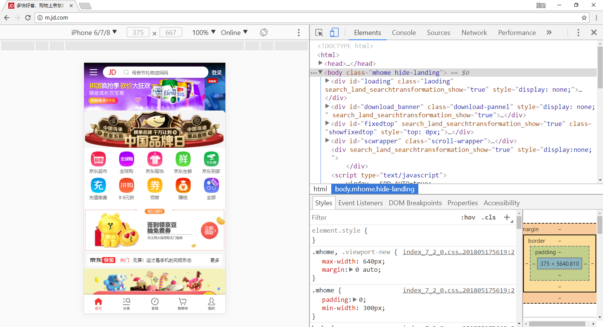
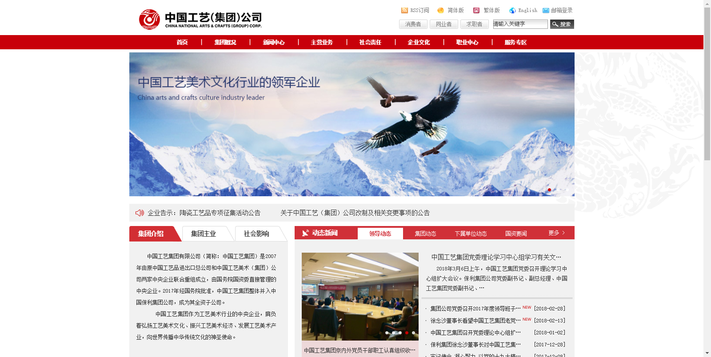
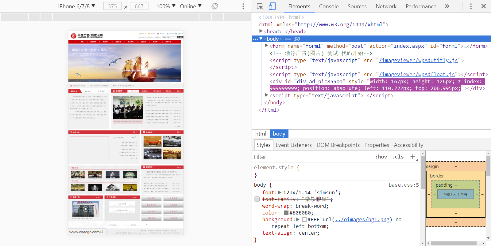

## 移动端开发介绍

### 什么是移动端web开发

在移动端进行web页面的开发，开发出来的页面是运行在浏览器上的

### 移动端开发与PC端开发的区别

移动端浏览器大多基于webkit内核，属于高级浏览器，支持h5c3特性，不需要考虑兼容性问题

## 移动端开发初探

### 模拟器介绍

在日常开发中都是使用电脑开发项目的，在开发过程中需要不断切换到移动设备中查看效果比较繁琐，所以谷歌浏览器为开发人员提供了移动设备模拟器。



### 常见移动端网站

- http://m.jd.com
- https://h5.m.taobao.com

### PC端页面在移动设备中的表现
- http://www.cnacgc.com
- 网页放在移动设备中被缩小显示
- 不符合我们的视觉习惯 需要想办法让网站不缩放





## 视口

### 什么是视口

- 浏览网页的窗口，视口的大小决定了当前设备是否能够将网页完整呈现。
- PC端在浏览器最大化的情况下，视口的宽度就是电脑屏幕的宽度。
- 移动端，设备厂商为了能够将PC端网页完整的显示在移动设备中，强制将视口的宽度设置为了980px
  - 但是移动端设备屏幕宽度远远小于这个数值
  - 所以最终的表现结果就是网页完整显示，但是被等比缩小为设备屏幕的宽度

在移动端这种展现页面的方式对于用户体验来说是极差的。

### 如何约束视口宽度

让视口的宽度和设备的宽度保持一致，那么它将不会被缩放.

生成约束视口的快捷键 meta:vp

```html
<meta name="viewport" content="width=device-width, user-scalable=no, initial-scale=1.0, maximum-scale=1.0, minimum-scale=1.0">
```

## 流式布局

### 流式布局

即百分比布局，将width,padding,margin属性用百分比的形式表示

### 注意

在百分比的世界中，padding，margin四个方向都是相对于父级宽度计算

## 移动端京东项目
### 如何在真实在设备中查看网页效果?

1. 移动设备和PC设备需要在同一个网络环境下
2. 查看自己电脑的IP地址
3. 以IP的形式查看页面(将localhost改成IP)
4. 用二维码工具生成二维码 用手机扫描即可

### css初始化

+ 取消点击链接或文本框高亮的默认效果 -webkit-tap-highlight-color:transparent;
+ 去掉文本框或下拉框的默认样式 -webkit-appearance:none;
+ 禁止用户选择页面中的文字 -webkit-user-select:none;
+ 使局部滚动更加顺滑 -webkit-overflow-scrolling:touch;
+ 更改placeholder文字颜色 input::-webkit-input-placeholder,textarea::-webkit-input-placeholder{}
+ 设置所有标签的盒模型为内减 box-sizing:border-box;

### 移动设备高清图

retina视网膜屏幕，即高清屏，能够使图片呈现的更加细腻。

这要求在做移动端开发时，需要提供更加清晰的图片。

window.devicePixelRatio 获取当前设备的屏幕像素密度比

### 时间转换公式

- 时：Math.floor(t%86400/3600)
- 分：Math.floor(t%86400%3600/60)
- 秒：Math.floor(t%60)
- 百以内取十位 Math.floor(num/10)
- 百以内取个位 num%10

### Touch事件

- touchstart：当手指触碰屏幕时候触发
- touchmove：当手指在屏幕上滑动时连续触发
- touchend：当手指离开屏幕时触发
- touchcancel：系统停止跟踪触摸时候会触发 (这个事件不会经常使用,了解即可)
- 绑定事件的方法
  - dom.addEventListener('touchstart',function(e){});
  - dom.addEventListener('touchmove',function(e){});
  - dom.addEventListener('touchend',function(e){});
- 事件对象中包含移动端特有的属性
  - touches 当前屏幕上所有触摸点的集合列表

案例1：封装左滑事件、右滑事件、上滑事件、下滑事件

案例2：封装tap轻敲事件(click事件在移动端有300ms的延迟)

### 过渡和动画结束事件

- transitionEnd 过渡结束后触发
- 绑定事件的方法
  - dom.addEventListener('webkitTransitionEnd',function(e){});
  - dom.addEventListener('transitionEnd',function(e){});
- animationEnd 动画结束后触发
- 绑定事件的方法
  - dom.addEventListener('webkitAnimationEnd',function(e){ });
  - dom.addEventListener('animationEnd',function(e){ });

### [swiper插件的介绍](https://github.com/nolimits4web/Swiper)

## 响应式web开发

### 为什么要学习响应式开发

- 移动互联网成熟,PC端网页在移动设备中用户体验不好
- 初期的解决方案是针对移动设备单独做一套网站
- 移动设备尺寸多种多样,不可能针对每一种设备尺寸单独做一套网站
- 越来越多的客户要求网站能够在移动设备中有一个良好的用户体验

### 什么是响应式开发?

检测屏幕宽度，针对不同的屏幕宽度为相同的HTML结构设置不同的样式，以呈现出符合当前屏幕宽度网站样式。

### 屏幕尺寸的划分

- 超小屏幕  768以下
- 小屏设备  768px ~ 992px
- 中等屏幕  992px ~ 1200px
- 宽屏设备  1200px ~ 1920px

### 响应式开发的原理

- css3媒体查询(Media Query)
- 检测屏幕宽度，为不同的屏幕尺寸设置不同的样式

```html
<!-- 第一种写法 -->
<style>
    @media screen and (max-width:768px){

    }
</style>

<!-- 第二种写法 -->
<link rel="stylesheet" href="" media="screen and (max-width:768px)">
```

- 当查询区间有重叠的时候,后面的样式优先
- 写媒体查询的时候尽量避免重复的查询区间

案例：QQTIM

### 移动开发与响应式开发对比

- 移动Web开发+PC开发
  - 应用场景
    - 一般在已经有PC端的网站，开发移动端的时候，只需单独开发移动端。
  - 开发效率
    - 针对性强,开发效率高
  - 适配范围
    - 只适配移动设备，pad上体验相对较差
  - 执行效率
    - 代码简洁，加载快

- 响应式开发
  - 应用场景
    - 新建的一些网站,要求适配移动端,所以就一套页面兼容各个终端,灵活
  - 开发效率
    - 兼容各种终端,效率低
  - 适配范围
    - 可以适配各种终端
  - 执行效率
    - 代码相对复杂，加载慢

  移动web开发和响应式开发都是现在主流的开发模式，使用的都是流式布局来适配不同的设备

### BootStrap框架

- 简洁、直观、强悍的前端开发框架，让web开发更迅速、简单。
  - 将网站中一些常见组件的HTML和CSS以及JS提前定义好，使用者只需要复制粘贴，然后再根据需求修改即可，目的是减少开发难度，提高开发效率。
- 作者:Twitter公司
- [英文官网](http://getbootstrap.com)
- [中文官网](http://www.bootcss.com/)

### 为什么要使用Bootstrap框架

- 使用人数众多，足够稳定，不断更新迭代
- 代码简洁、直观、规范
- 让开发更简单,提高了开发的效率
- 扩展性较强,可以自定义默认样式

### Bootstrap版本

- 2.x.x 停止维护
- 3.x.x 目前使用最多
  - 稳定，但是放弃了IE6-IE7。对IE8支持但是界面效果不好。偏向用于开发响应式布局、移动设备优先的Web项目。
- 4.x.x 测试阶段

### Bootstrap讲解

#### 基本模板

```html
<!DOCTYPE html>
<html lang="zh-CN">
  <head>
    <meta charset="utf-8">
    <meta http-equiv="X-UA-Compatible" content="IE=edge">
    <meta name="viewport" content="width=device-width, initial-scale=1">
    <!-- 上述3个meta标签*必须*放在最前面，任何其他内容都*必须*跟随其后！ -->
    <title>Bootstrap 101 Template</title>

    <!-- Bootstrap -->
    <link href="https://cdn.bootcss.com/bootstrap/3.3.7/css/bootstrap.min.css" rel="stylesheet">

    <!-- HTML5 shim 和 Respond.js 是为了让 IE8 支持 HTML5 元素和媒体查询（media queries）功能 -->
    <!-- 警告：通过 file:// 协议（就是直接将 html 页面拖拽到浏览器中）访问页面时 Respond.js 不起作用 -->
    <!--[if lt IE 9]>
      <script src="https://cdn.bootcss.com/html5shiv/3.7.3/html5shiv.min.js"></script>
      <script src="https://cdn.bootcss.com/respond.js/1.4.2/respond.min.js"></script>
    <![endif]-->
  </head>
  <body>
    <h1>你好，世界！</h1>

    <!-- jQuery (Bootstrap 的所有 JavaScript 插件都依赖 jQuery，所以必须放在前边) -->
    <script src="https://cdn.bootcss.com/jquery/1.12.4/jquery.min.js"></script>
    <!-- 加载 Bootstrap 的所有 JavaScript 插件。你也可以根据需要只加载单个插件。 -->
    <script src="https://cdn.bootcss.com/bootstrap/3.3.7/js/bootstrap.min.js"></script>
  </body>
</html>
```

#### 布局容器

通常用于制作页面版心。

```html
<!-- 在不同的屏幕尺寸下布局容器的尺寸也是不同的 始终居中于屏幕 -->
<div class="container"></div>
<!-- 流式布局容器 容器宽度始终100% -->
<div class="container-fluid"></div>
```

#### 全局样式

设置全局CSS样式，对基本的HTML标签样式进行增强。包含排版、表格、表单、按钮、图片等等。[详见文档](https://v3.bootcss.com/css/)

#### 组件样式

包含网站用常见的组件样式，比如网站导航，下拉菜单，字体图片、警告框、弹出框等等。[详见文档](https://v3.bootcss.com/components/) 

#### JavaScript 插件

Bootstrap依赖jQuery，提供了一些jQuery插件，比如轮播图插件，滚动监听插件，弹出框插件等等。[详见文档](https://v3.bootcss.com/javascript/)

#### 栅格系统

栅格系统将网站布局看成是很多的行与列，通过Bootstrap中提供的类样式可以非常方便的创建出这些行和列。

网页中的具体内容将被放置在这些列中。

```html
<!-- 通过类名row创建行 -->
<div class="row">
    <!-- 通过col-md-数值 类名创建列 -->
	<div class="col-md-6">内容1</div>
	<div class="col-md-6">内容2</div>
</div>
```

- Bootstrap将一行默认分为12列，可以通过类名中的数值来定义当前列占总列数的多少。

- 可以将类名中的md替换成lg、sm、xs

  - lg 当屏幕宽度 ≥1200px 时生效
  - md 当屏幕宽度 ≥992px 时生效
  - sm 当屏幕宽度 ≥768px 时生效
  - xs 当屏幕宽度 <768px  时生效

- 列偏移

  - 使用 .col-md-offset-*类可以将列向右侧偏移，设置列与列之间的间距。

- 列嵌套

  - 列中可以再次嵌套栅格系统，称为列嵌套，以支撑复杂的网页布局。

    ```html
    <div class="row">
        <div class="col-md-6">
            <div class="row">
                <div class="col-md-6"></div>
                <div class="col-md-6"></div>
            </div>
        </div>
        <div class="col-md-6"></div>
    </div>
    ```

#### 工具类

| 类名称          | 解释       |
| ------------ | -------- |
| text-left    | 文本左对齐    |
| text-center  | 文本居中对齐   |
| text-right   | 文本右对齐    |
| center-block | 让块级元素居中  |
| pull-left    | 左浮动      |
| pull-right   | 右浮动      |
| clearfix     | 清除浮动     |
| show         | 显示元素     |
| hidden       | 隐藏元素     |
| hidden-xs    | 在超小屏幕中隐藏 |
| hidden-sm    | 在小屏幕中隐藏  |
| hidden-md    | 在中等屏幕中隐藏 |
| hidden-lg    | 在大屏幕中隐藏  |

## 微金所

### 项目结构

- weijinsuo............项目文件夹
  - js...................js文件目录
  - assets..................第三方框架目录
  - font................字体文件目录
  - images...............图片文件目录
  - css..................css文件目录
  - index.html...........站点入口

### 编码规范

#### HTML约定

- 在head中引入必要的CSS文件，优先引用第三方的CSS，方便我们自己的样式覆盖。
- 在body末尾引入必要的JS文件，优先引用第三方的JS，注意JS文件之间的依赖关系

#### CSS约定

- 除了公共级别样式，其余样式全部由 模块前缀
- 尽量使用 直接子代选择器，少用间接子代 避免覆盖

### 字体图标

```css
@font-face {
  font-family: 'XXX';
  src: url('../font/MiFie-Web-Font.eot') format('embedded-opentype'), 
  url('../font/MiFie-Web-Font.svg') format('svg'), 
  url('../font/MiFie-Web-Font.ttf') format('truetype'), 
  url('../font/MiFie-Web-Font.woff') format('woff');
}
```

```css
.wjs_icon_phone::before{
    content: "\e908";
}
.wjs_icon_tel::before{
    content: "\e909";
}
.wjs_icon_logo::before{
    content: "\e920";
}
.wjs_icon_word::before{
    content: "\e93e";
}
.wjs_icon_E903::before{
    content: "\e903";
}
.wjs_icon_E906::before{
    content: "\e906";
}
.wjs_icon_E905::before{
    content: "\e905";
}
.wjs_icon_E907::before{
    content: "\e907";
}
.wjs_icon_E901::before{
    content: "\e901";
}
.wjs_icon_E900::before{
    content: "\e900";
}
.wjs_icon_E904::before{
    content: "\e904";
}
.wjs_icon_E902::before{
    content: "\e902";
}
.wjs_icon_E906::before{
    content: "\e906";
}
.wjs_icon_new01::before{
    content: "\e90e";
}
.wjs_icon_new02::before{
    content: "\e90f";
}
.wjs_icon_new03::before{
    content: "\e910";
}
.wjs_icon_new04::before{
    content: "\e911";
}
.wjs_icon_partner01::before{
    content:"\e946";
}
.wjs_icon_partner02::before{
    content: "\e92f";
}
.wjs_icon_partner03::before{
    content: "\e92e";
}
.wjs_icon_partner04::before{
    content: "\e92a";
}
.wjs_icon_partner05::before{
    content: "\e929";
}
.wjs_icon_partner06::before{
    content: "\e931";
}
.wjs_icon_partner07::before{
    content: "\e92c";
}
.wjs_icon_partner08::before{
    content: "\e92b";
}
.wjs_icon_partner09::before{
    content: "\e92d";
}
```

## LESS 

### 为什么要学习LESS 

CSS作为标记语言，语法相对简单，对使用者的要求较低 ，但同时也带来一些问题：

- CSS没有逻辑性，不方便维护及扩展，不利于复用 
- 对非前端工程师来说，很难写出组织良好且易于维护的CSS代码

### [LESS ](https://less.bootcss.com/)是什么

Less是一门CSS预处理语言，在CSS语言的基础上做了扩充，增加了诸如变量、混合（mixin）、函数等功能，让 CSS更易维护。

CSS与LESS的关系就像JavaScript与jQuery的关系。

- 提高CSS编写效率，减少大量重复代码的编写，让CSS更具有维护性、扩展性。
- 代码结构清晰，便于修改。 
- 让我们用类似JS的语法编写CSS代码。
- 完全兼容CSS代码，可以方便地应用到老项目中 。

### LESS编译器安装

由于浏览器只认识CSS代码，所以需要将编写好的less转换为CSS后再拿到浏览器中运行。less官方提供了编译器，安装步骤如下：

- 由于less编译器依赖node环境,所以需要先安装node环境
  - 安装程序出现2502、2503错误解决方法
    - 以管理员身份运行cmd
    - msiexec /package 带文件名称的文件路径
  - 检测node是否安装成功
    - 打开命令行工具 win + r => cmd => 回车
    - node -v 查看安装node版本
    - npm  –v 查看npm版本
      - npm是node环境提供的下载工具 可以用它来下载less编译器
- 在线安装less
  - cmd中运行 npm install less -g
  - 检测less是否安装成功 lessc -v
- 离线安装
  - C:\Users\Administrator\AppData\Roaming\npm
  - 将Npm.Zip解压进去
- 在cmd中编译less文件
  - lessc less.less less.css
  - lessc 要编译的less文件 编译后的css文件
- [sublime text配置](http://www.jianshu.com/p/1ebf12edc967)
  - 安装sublime插件 less Less2Css
  - 安装依赖工具 在cmd中运行 npm install less-plugin-clean-css -g
- [Webstorm配置](http://www.jianshu.com/p/e99dc56d44c3)

### LESS语法学习

#### 注释

> 在代码中加入注释，对代码进行解释说明的方式。

| 多行注释              | 单行注释            |
| ----------------- | --------------- |
| /* 会被编译到CSS文件中 */ | // 不会被编译到CSS文件中 |

#### 变量 

> LESS允许开发者自定义变量，使得样式修改起来更加方便，比如网页换肤功能。

1. 将变量作为属性值使用

```less
@mainColor:#E93223;
body{
  color: @mainColor;
}
```

2. 将变量作为选择器使用

```less
@header:header;
.@{header}{
    color:@mainColor;
}
```

3. 将变量作为路径使用

```less
@imgUrl:'../images/';
.bgi{
    background:url('@{imgUrl}1.jpg');
}
```
#### 混合

> 混合就是一种将一系列属性从一个规格集引入到另一种规格集的方式（定义公共样式）

1. 混合的基本使用

```less
.border{
    border:1px solid #e0e0e0;
}
h1{
    font-size:40px;
    .border;
}
h2{
    font-size:30px;
    .border;
}
```

2. 禁止公共样式被编译到CSS中

```less
.border(){
    border:1px solid #e0e0e0;
}
h1{
    font-size:40px;
    .border;
}
h2{
    font-size:30px;
    .border;
}
```

3. 为公共样式传递参数

```less
.border(@size){
    border:@size solid #e0e0e0;
}
h1{
    font-size:40px;
    .border(10px);
}
h2{
    font-size:30px;
    .border(20px);
}
```

4. 为公共样式传递多个参数，参数之间用分号隔开

```less
.border(@size;@style;@color){
    border:@size @style @color;
}
h1{
    font-size:40px;
    .border(10px;solid;skyblue);
}
h2{
    font-size:30px;
    .border(20px;solid;pink);
}
```

5. 为公共样式提高优先级

```less
.border(@size;@style;@color){
    border:@size @style @color;
    position:relative;
}
h1{
    font-size:40px;
    .border(10px;solid;skyblue)!important;
}
h2{
    font-size:30px;
    .border(20px;solid;pink);
}
```
#### 嵌套

> HTML结构具有嵌套性，而对应的CSS却是用空格表示父子级嵌套关系，看起来一点也不清晰。
> LESS中可以使用嵌套为CSS添加如同HTML一样的嵌套关系。

```less
#wjs_banner{
  .carousel-inner{
    > div.item{
      a.img_box{
        background: url("../images/slide_01_2000x410.jpg") no-repeat center center;
        height: 410px;
        /*调用redBorder mixin*/
        display: block;
        .redBorder();
        /*调用@mainColor 变量*/
        &:hover{
          color: @mainColor;
        }
      }
      a.img_mobile{
        width: 100%;
        display: block;
        img{
          width: 100%;
          display: block;
        }
      }
    }
  }
}
```
#### 导入

> 代码组织方式上的优化，可以将不同功能的代码放置在不同的文件中，起到归类的作用，方便维护。
>  比如可以将所有的变量放入一个文件中，将文件导入到当前文件中，就可以使用这些变量了。

```less
@import "base";
.f_left{
  float: @right;
}
```
注意：如果导入的文件是 `.less` 扩展名，则可以将扩展名省略掉： 

#### 内置函数

> Less 内置了多种函数用于转换颜色、处理字符串、算术运算等。

应用场景：

- 网站通常会有一个主色若干辅色，辅色的取值通常是在主色的基础上增加或减少亮度、透明度、饱和度。
- 通过判断当前值是否是某种类型，以达到输出不同样式的目的。

```less
ceil(@number); // 向上取整
floor(@number); // 向下取整
percentage(@number); // 将数字转换为百分比，例如 0.5 -> 50%
round(number, [places: 0]); // 四舍五入取整
abs(number); // * 数字的绝对值
pi(); // * 返回PI
red(@color); // 从颜色值中提取 'red' 值（红色）
green(@color); // 从颜色值中提取 'green' 值（绿色）
blue(@color); // 从颜色值中提取 'blue' 值（蓝色）
alpha(@color); // 从颜色值中提取 'alpha' 值（透明度）
saturate(@color, 10%); // 饱和度增加 10%
desaturate(@color, 10%); // 饱和度降低 10%
lighten(@color, 10%); // 亮度增加 10%
darken(@color, 10%); // 亮度降低 10%
fadein(@color, 10%); // 透明度增加 10%
fadeout(@color, 10%); // 透明度降低 10%
fade(@color, 50%); // 设定透明度为 50%
greyscale(@color); // 完全移除饱和度，输出灰色
iscolor(@colorOrAnything); // 判断一个值是否是颜色
isnumber(@numberOrAnything); // 判断一个值是否是数字（可含单位）
isstring(@stringOrAnything); // 判断一个值是否是字符串
isurl(@urlOrAnything); // 判断一个值是否是url
ispixel(@pixelOrAnything); // 判断一个值是否是以px为单位的数值
ispercentage(@percentageOrAnything); // 判断一个值是否是百分数
```
[函数手册](https://less.bootcss.com/functions/)

#### 条件判断

> 可以根据判断条件输出不同的样式。

```less
// 如果颜色中的亮度值大于等于50% 设置背景颜色为黑色
.mixin(@a) when( lightness(@a) >= 50%){
    background:#000;
}
// 如果颜色中的亮度值小于等于50% 设置背景颜色为白色
.mixin(@a) when(lightness(@a) <= 50%){
    background:#FFF;
}

.classA{
    // #ddd => rgb(221,221,221) 亮度高 输出背景黑色
    .mixin(#ddd);
}

.classB{
    // #555 => rgb(85,85,85) 亮度低 输出背景白色
    .mixin(#555)
}
```
#### 计算

```less
@back:#333;
.test{
  border: 1px solid @back*2;
  background: lighten(#000, 10%);
  color:darken(#000, 10%);
}
```

### 在页面中使用LESS

- 在页面中引入编译好的CSS文件
- 在页面中未编译好的CSS文件

```html
<link rel="stylesheet/less" type="text/css" href="styles.less" />
<script src="less.js" type="text/javascript"></script>
```

## rem布局

一套代码适应不同屏幕尺寸。

### 什么是rem

- rem (font size of the root element) 相对于根元素字体大小的单位
- 将像素转换为rem
  - rem = 目标像素值/根元素的字体大小

### 匹配屏幕

`document.documentElement.style.fontSize = document.documentElement.clientWidth/750*100`

## [zepto介绍](http://zeptojs.bootcss.com/)

- 使用zepto做焦点图
- swipeLeft swipeRight

